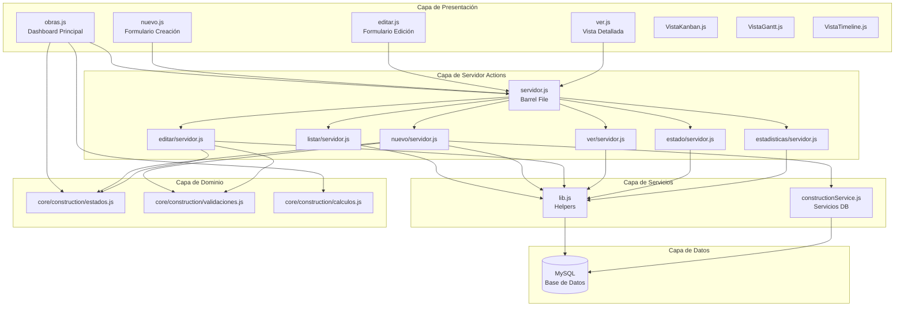
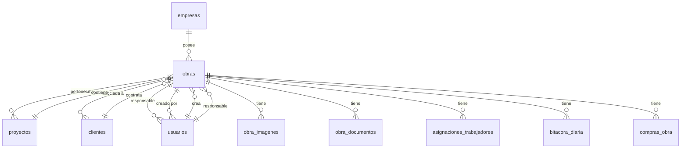
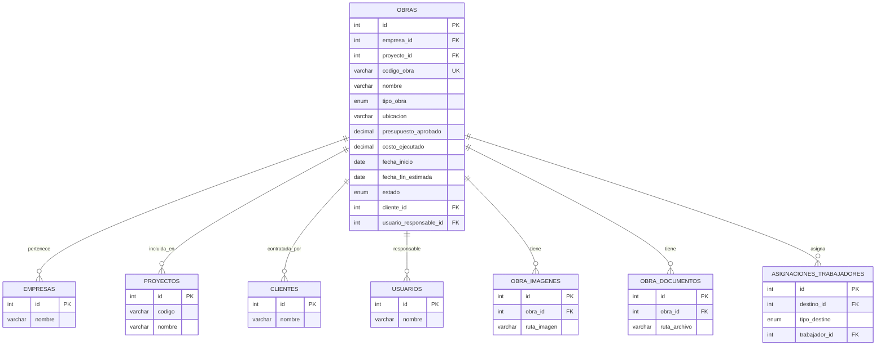
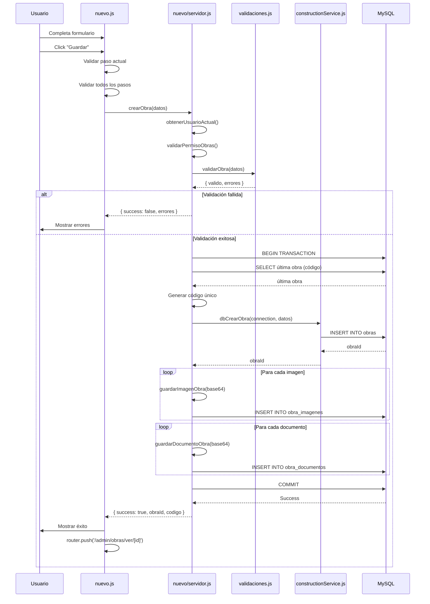

# Documentación Técnica del Módulo de Obras
## Especificación Funcional IEEE 830

**Versión:** 1.0  
**Fecha:** 2026-01-21  
**Autor:** Equipo de Desarrollo  
**Estado:** Documentación Técnica Completa

---

## Tabla de Contenidos

1. [Arquitectura del Módulo](#1-arquitectura-del-módulo)
2. [Lógica de Negocio](#2-lógica-de-negocio)
3. [Modelo de Datos](#3-modelo-de-datos)
4. [Capa de Presentación](#4-capa-de-presentación)
5. [Flujo de Datos Completo](#5-flujo-de-datos-completo)
6. [Análisis Crítico](#6-análisis-crítico)

---

## 1. Arquitectura del Módulo

### 1.1 Estructura de Carpetas y Archivos

```
_Pages/admin/obras/
├── obras.js                    # Componente principal del dashboard
├── obras.module.css            # Estilos del dashboard
├── servidor.js                 # Barrel file - reexporta funciones de casos de uso
├── lib.js                      # Helpers compartidos (utilidades, formateo)
│
├── listar/
│   ├── listar.js              # Componente de listado (no usado actualmente)
│   ├── listar.module.css
│   └── servidor.js            # CU-001: Obtener obras
│
├── nuevo/
│   ├── nuevo.js               # Componente de creación (wizard multi-paso)
│   ├── nuevo.module.css
│   └── servidor.js            # CU-002: Crear obra
│
├── editar/
│   ├── editar.js              # Componente de edición
│   └── servidor.js            # CU-003: Obtener obra para editar
│                              # CU-004: Actualizar obra
│
├── ver/
│   ├── ver.js                 # Componente de visualización detallada
│   ├── ver.module.css
│   └── servidor.js            # CU-005: Obtener obra con detalle completo
│
├── estado/
│   └── servidor.js            # CU-006: Cambiar estado de obra
│
├── estadisticas/
│   └── servidor.js            # CU-007: Obtener estadísticas de obra
│
├── formulario/
│   └── servidor.js            # CU-008: Obtener datos para selectores
│
├── bitacora/
│   ├── nueva.js               # Componente de registro de bitácora
│   ├── bitacora.module.css
│   └── servidor.js            # CU-009: Obtener trabajadores asignados
│                              # CU-010: Registrar bitácora
│
└── components/
    ├── VistaKanban.js         # Vista Kanban de obras
    ├── VistaGantt.js          # Vista Gantt de cronograma
    └── VistaTimeline.js       # Vista Timeline de obras
```

### 1.2 Ubicación en el Proyecto

**Rutas Completas:**

| Componente | Ruta Completa |
|------------|---------------|
| Dashboard Principal | `_Pages/admin/obras/obras.js` |
| Server Actions Barrel | `_Pages/admin/obras/servidor.js` |
| Helpers | `_Pages/admin/obras/lib.js` |
| Core Compartido | `_Pages/admin/core/construction/` |
| Servicios DB | `lib/services/constructionService.js` |
| Routing Next.js | `app/(admin)/admin/obras/page.js` |

### 1.3 Dependencias y Relaciones

#### Dependencias Internas

```mermaid
graph TD
    A[obras.js] --> B[servidor.js]
    A --> C[core/construction/estados.js]
    A --> D[core/construction/calculos.js]
    
    B --> E[listar/servidor.js]
    B --> F[nuevo/servidor.js]
    B --> G[editar/servidor.js]
    B --> H[ver/servidor.js]
    B --> I[estado/servidor.js]
    B --> J[estadisticas/servidor.js]
    B --> K[formulario/servidor.js]
    B --> L[bitacora/servidor.js]
    
    E --> M[lib.js]
    F --> M
    G --> M
    H --> M
    I --> M
    J --> M
    K --> M
    L --> M
    
    F --> N[core/construction/validaciones.js]
    G --> N
    
    F --> O[lib/services/constructionService.js]
    L --> O
    
    M --> P[@/_DB/db]
    O --> P
```

#### Dependencias Externas

| Módulo | Propósito | Tipo |
|--------|-----------|------|
| `core/construction` | Estados, validaciones, cálculos compartidos | Compartido |
| `lib/services/constructionService.js` | Servicios de base de datos reutilizables | Servicio |
| `@/_DB/db` | Pool de conexiones MySQL | Infraestructura |
| `next/headers` | Cookies para autenticación | Framework |
| `next/navigation` | Router para navegación | Framework |

### 1.4 Diagrama de Arquitectura de Componentes



---

## 2. Lógica de Negocio

### 2.1 Casos de Uso Identificados

#### CU-001: Obtener Lista de Obras

**Archivo:** `_Pages/admin/obras/listar/servidor.js`

**Descripción:** Obtiene todas las obras de la empresa con filtros opcionales.

**Actor(es):** Administrador de Obras

**Precondiciones:**
- Usuario autenticado
- Usuario pertenece a una empresa válida
- Permisos de obras validados

**Postcondiciones:**
- Lista de obras formateadas disponible en el frontend
- Información de relaciones (proyecto, cliente, creador) incluida

**Flujo Principal:**

```javascript
1. Obtener usuario actual desde cookies
2. Validar permisos de obras
3. Obtener conexión a base de datos
4. Construir query SQL con JOINs:
   - obras (o)
   - proyectos (p) - LEFT JOIN
   - clientes (c) - LEFT JOIN
   - usuarios (u) - LEFT JOIN
   - Subquery: trabajadores activos
5. Aplicar filtros opcionales:
   - Por estado
   - Por búsqueda (nombre, código, ubicación)
6. Ordenar por:
   - Estado (activa primero)
   - Fecha de creación DESC
7. Ejecutar query
8. Formatear obras usando formatearObra()
9. Retornar resultado
```

**Parámetros de Entrada:**

| Parámetro | Tipo | Requerido | Descripción |
|-----------|------|-----------|-------------|
| `filtros` | Object | No | Objeto con filtros opcionales |
| `filtros.estado` | String | No | Estado de obra a filtrar |
| `filtros.busqueda` | String | No | Texto de búsqueda |

**Proceso de Ejecución Detallado:**

```javascript
// 1. Autenticación y validación
const usuario = await obtenerUsuarioActual()
validarPermisoObras(usuario)

// 2. Construcción de query base
let query = `
    SELECT 
        o.*,
        p.nombre AS proyecto_nombre,
        c.nombre AS cliente_nombre,
        u.nombre AS creador_nombre,
        (
            SELECT COUNT(DISTINCT at.trabajador_id)
            FROM asignaciones_trabajadores at
            WHERE at.tipo_destino = 'obra'
            AND at.destino_id = o.id
            AND at.estado = 'activa'
        ) AS trabajadores_activos
    FROM obras o
    LEFT JOIN proyectos p ON o.proyecto_id = p.id
    LEFT JOIN clientes c ON o.cliente_id = c.id
    LEFT JOIN usuarios u ON o.creado_por = u.id
    WHERE o.empresa_id = ?
`

// 3. Aplicación de filtros dinámicos
if (filtros.estado) {
    query += ` AND o.estado = ?`
    params.push(filtros.estado)
}

if (filtros.busqueda) {
    query += ` AND (o.nombre LIKE ? OR o.codigo_obra LIKE ? OR o.ubicacion LIKE ?)`
    const busqueda = `%${filtros.busqueda}%`
    params.push(busqueda, busqueda, busqueda)
}

// 4. Ordenamiento inteligente
query += ` ORDER BY 
    CASE o.estado
        WHEN 'activa' THEN 1
        WHEN 'suspendida' THEN 2
        WHEN 'finalizada' THEN 3
        WHEN 'cancelada' THEN 4
    END,
    o.fecha_creacion DESC
`

// 5. Ejecución y formateo
const [obras] = await connection.execute(query, params)
const obrasFormateadas = obras.map(formatearObra)
```

**Operaciones de Base de Datos:**

- **Query Principal:** SELECT con múltiples JOINs
- **Subquery:** Conteo de trabajadores activos
- **Índices Utilizados:**
  - `idx_empresa` (empresa_id)
  - `idx_estado` (estado)
  - `idx_fechas` (fecha_creacion)

**Valores de Retorno:**

```typescript
{
    success: boolean,
    obras?: Array<{
        id: number,
        codigo: string,
        nombre: string,
        tipo: string,
        ubicacion: string,
        presupuesto_aprobado: number,
        costo_real: number,
        estado: string,
        fecha_inicio: string,
        fecha_fin_estimada: string,
        cliente_nombre?: string,
        proyecto_nombre?: string,
        trabajadores_activos: number,
        // ... más campos
    }>,
    mensaje?: string
}
```

**Manejo de Errores:**

```javascript
try {
    // ... lógica principal
} catch (error) {
    console.error('Error al obtener obras:', error)
    
    // Logging para debugging (agent log)
    fetch('http://127.0.0.1:7242/ingest/...', {
        method: 'POST',
        body: JSON.stringify({
            location: '_Pages/admin/obras/listar/servidor.js:76',
            message: 'Obras query error',
            data: {
                error: error.message,
                code: error.code,
                sql: error.sql?.substring(0, 300)
            }
        })
    }).catch(() => {})
    
    if (connection) connection.release()
    return {
        success: false,
        mensaje: error.message || 'Error al cargar obras'
    }
}
```

**Reglas de Negocio:**

1. **Filtrado por Empresa:** Todas las obras deben pertenecer a la empresa del usuario
2. **Ordenamiento por Prioridad:** Obras activas siempre aparecen primero
3. **Conteo de Trabajadores:** Solo cuenta trabajadores con estado 'activa'
4. **Formateo Consistente:** Todas las obras pasan por `formatearObra()` para normalización

---

#### CU-002: Crear Nueva Obra

**Archivo:** `_Pages/admin/obras/nuevo/servidor.js`

**Descripción:** Crea una nueva obra con validaciones y procesamiento de archivos.

**Actor(es):** Administrador de Obras

**Precondiciones:**
- Usuario autenticado
- Datos del formulario validados
- Empresa válida

**Postcondiciones:**
- Obra creada en base de datos
- Código único generado automáticamente
- Imágenes y documentos procesados (si existen)
- Estado inicial: 'activa'

**Flujo Principal:**

```javascript
1. Obtener usuario actual
2. Validar permisos
3. Validar datos usando validarObra()
4. Iniciar transacción
5. Generar código único si no existe:
   - Buscar última obra de la empresa
   - Extraer número del código
   - Incrementar y formatear: OB-YYYY-XXX
6. Mapear datos del formulario a formato BD
7. Crear obra usando dbCrearObra()
8. Procesar imágenes (si existen):
   - Convertir base64 a archivo
   - Guardar en sistema de archivos
   - Registrar en obra_imagenes
9. Procesar documentos (si existen):
   - Guardar archivo
   - Registrar en obra_documentos
10. Commit transacción
11. Retornar éxito con ID y código
```

**Parámetros de Entrada:**

| Parámetro | Tipo | Requerido | Validación |
|-----------|------|-----------|------------|
| `datos.nombre` | String | Sí | No vacío, trim |
| `datos.ubicacion` | String | Sí | No vacío, trim |
| `datos.presupuesto_aprobado` | Number | Sí | > 0 |
| `datos.fecha_inicio` | Date/String | Sí | Formato válido |
| `datos.fecha_fin_estimada` | Date/String | Sí | > fecha_inicio |
| `datos.tipo_obra` | Enum | No | Default: 'construccion' |
| `datos.imagenes` | Array | No | Array de objetos base64 |
| `datos.documentos` | Array | No | Array de documentos |

**Proceso de Ejecución Detallado:**

```javascript
// 1. Validación de datos
const validacion = validarObra(datos)
if (!validacion.valido) {
    return {
        success: false,
        mensaje: Object.values(validacion.errores)[0],
        errores: validacion.errores
    }
}

// 2. Generación de código único
let codigoObra = datos.codigo || datos.codigo_obra
if (!codigoObra) {
    const [ultimaObra] = await connection.execute(
        'SELECT codigo_obra FROM obras WHERE empresa_id = ? ORDER BY id DESC LIMIT 1',
        [usuario.empresaId]
    )
    
    let numero = 1
    if (ultimaObra.length > 0 && ultimaObra[0].codigo_obra) {
        const match = ultimaObra[0].codigo_obra.match(/\d+$/)
        if (match) numero = parseInt(match[0]) + 1
    }
    
    codigoObra = `OB-${new Date().getFullYear()}-${String(numero).padStart(3, '0')}`
}

// 3. Mapeo de datos
const datosBD = mapearDatosFormularioABD(datos)

// 4. Creación de obra
const obraId = await dbCrearObra(connection, {
    ...datosBD,
    empresa_id: usuario.empresaId,
    codigo_obra: codigoObra,
    estado: ESTADOS_OBRA.ACTIVA,
    creado_por: usuario.id
})

// 5. Procesamiento de imágenes
if (datos.imagenes && Array.isArray(datos.imagenes) && datos.imagenes.length > 0) {
    for (const imagen of datos.imagenes) {
        if (imagen.base64) {
            try {
                const rutaImagen = await guardarImagenObra(imagen.base64, obraId)
                await connection.execute(
                    `INSERT INTO obra_imagenes (
                        obra_id, categoria, descripcion, ruta_imagen, fecha_toma, subido_por
                    ) VALUES (?, ?, ?, ?, ?, ?)`,
                    [
                        obraId,
                        imagen.categoria || 'avance',
                        imagen.descripcion || null,
                        rutaImagen,
                        imagen.fecha_toma || null,
                        usuario.id
                    ]
                )
            } catch (error) {
                console.error('Error al guardar imagen:', error)
                // Continuar con otras imágenes aunque una falle
            }
        }
    }
}
```

**Operaciones de Base de Datos:**

1. **SELECT:** Obtener última obra para código
2. **INSERT:** Crear obra principal
3. **INSERT (múltiples):** Registrar imágenes
4. **INSERT (múltiples):** Registrar documentos
5. **Transacción:** Todo en una transacción ACID

**Valores de Retorno:**

```typescript
{
    success: boolean,
    mensaje?: string,
    obraId?: number,
    codigo?: string,
    errores?: Object
}
```

**Reglas de Negocio:**

1. **Código Único:** Formato `OB-YYYY-XXX` donde XXX es secuencial por año
2. **Estado Inicial:** Siempre 'activa' al crear
3. **Presupuesto:** Debe ser mayor a 0
4. **Fechas:** fecha_fin_estimada > fecha_inicio
5. **Imágenes:** Máximo 10 por obra (definido en REGLAS_NEGOCIO)
6. **Transaccionalidad:** Si falla cualquier paso, se hace rollback completo

**Excepciones:**

- **Validación fallida:** Retorna errores específicos por campo
- **Error en guardado de imagen:** Continúa con otras imágenes, no aborta transacción
- **Error en guardado de documento:** Continúa con otros documentos
- **Error crítico:** Rollback completo de transacción

---

#### CU-003: Obtener Obra para Editar

**Archivo:** `_Pages/admin/obras/editar/servidor.js`

**Descripción:** Obtiene una obra específica con datos necesarios para edición.

**Actor(es):** Administrador de Obras

**Precondiciones:**
- Usuario autenticado
- obraId válido
- Obra pertenece a la empresa del usuario

**Postcondiciones:**
- Datos de obra disponibles para edición
- Relaciones (cliente, responsable) incluidas

**Flujo Principal:**

```javascript
1. Validar obraId (no null/undefined)
2. Convertir a número
3. Obtener usuario actual
4. Validar permisos
5. Obtener obra con JOINs:
   - clientes (c)
   - usuarios responsables (u)
6. Verificar existencia
7. Retornar obra
```

**Parámetros de Entrada:**

| Parámetro | Tipo | Requerido | Validación |
|-----------|------|-----------|------------|
| `obraId` | Number/String | Sí | Debe ser convertible a número |

**Operaciones de Base de Datos:**

```sql
SELECT o.*, 
       c.nombre AS cliente_nombre,
       u.nombre AS responsable_nombre
FROM obras o
LEFT JOIN clientes c ON o.cliente_id = c.id
LEFT JOIN usuarios u ON o.usuario_responsable_id = u.id
WHERE o.id = ? AND o.empresa_id = ?
```

**Reglas de Negocio:**

1. **Seguridad:** Verificación de empresa_id previene acceso no autorizado
2. **Validación de ID:** Conversión explícita y validación de NaN
3. **Datos Relacionados:** Incluye nombres de cliente y responsable para UI

---

#### CU-004: Actualizar Obra

**Archivo:** `_Pages/admin/obras/editar/servidor.js`

**Descripción:** Actualiza los datos de una obra existente.

**Actor(es):** Administrador de Obras

**Precondiciones:**
- Obra existe
- Obra pertenece a la empresa del usuario
- Datos validados

**Postcondiciones:**
- Obra actualizada en BD
- fecha_actualizacion actualizada automáticamente
- actualizado_por registrado

**Flujo Principal:**

```javascript
1. Validar datos usando validarObra()
2. Iniciar transacción
3. Verificar existencia de obra
4. Mapear datos del formulario
5. Ejecutar UPDATE con todos los campos
6. Commit transacción
7. Retornar éxito
```

**Operaciones de Base de Datos:**

```sql
UPDATE obras SET
    nombre = ?,
    descripcion = ?,
    tipo_obra = ?,
    ubicacion = ?,
    zona = ?,
    municipio = ?,
    provincia = ?,
    presupuesto_aprobado = ?,
    fecha_inicio = ?,
    fecha_fin_estimada = ?,
    cliente_id = ?,
    usuario_responsable_id = ?,
    observaciones = ?,
    actualizado_por = ?,
    fecha_actualizacion = CURRENT_TIMESTAMP
WHERE id = ? AND empresa_id = ?
```

**Reglas de Negocio:**

1. **Validación Previa:** Misma validación que creación
2. **Auditoría:** actualizado_por y fecha_actualizacion siempre se actualizan
3. **Seguridad:** Verificación de empresa_id en WHERE clause

---

#### CU-005: Obtener Obra con Detalle Completo

**Archivo:** `_Pages/admin/obras/ver/servidor.js`

**Descripción:** Obtiene una obra con todas sus relaciones y datos relacionados.

**Actor(es):** Administrador de Obras, Supervisor

**Precondiciones:**
- obraId válido
- Usuario autenticado

**Postcondiciones:**
- Obra completa con trabajadores, compras y bitácoras disponibles

**Flujo Principal:**

```javascript
1. Validar obraId
2. Obtener obra con JOINs básicos
3. Obtener trabajadores asignados (try-catch)
4. Obtener compras recientes (try-catch)
5. Obtener bitácoras recientes (try-catch)
6. Formatear y retornar
```

**Operaciones de Base de Datos:**

1. **Query Principal:** Obra con proyecto, cliente, creador
2. **Subquery:** Trabajadores activos
3. **Query Adicional:** Compras recientes (últimas 10)
4. **Query Adicional:** Bitácoras recientes (últimas 10)

**Características Especiales:**

- **Manejo de Tablas Opcionales:** Usa try-catch para tablas que pueden no existir aún
- **Límites:** Compras y bitácoras limitadas a 10 registros más recientes
- **Formateo:** Usa `formatearObra()` para normalización

---

#### CU-006: Cambiar Estado de Obra

**Archivo:** `_Pages/admin/obras/estado/servidor.js`

**Descripción:** Cambia el estado de una obra con registro de razón.

**Actor(es):** Administrador de Obras

**Precondiciones:**
- Obra existe
- Nuevo estado es válido
- Usuario tiene permisos

**Postcondiciones:**
- Estado actualizado
- Si es 'finalizada', fecha_fin_real registrada
- Observaciones actualizadas con historial

**Flujo Principal:**

```javascript
1. Obtener usuario
2. Validar permisos
3. Iniciar transacción
4. Verificar existencia de obra
5. Validar estado nuevo (debe estar en ESTADOS_OBRA)
6. Preparar actualización:
   - Si nuevoEstado === 'finalizada':
     - fecha_fin_real = hoy
7. Actualizar observaciones con timestamp y razón
8. Ejecutar UPDATE
9. Commit
10. Retornar éxito
```

**Parámetros de Entrada:**

| Parámetro | Tipo | Requerido | Descripción |
|-----------|------|-----------|-------------|
| `obraId` | Number | Sí | ID de la obra |
| `nuevoEstado` | String | Sí | Nuevo estado (debe ser válido) |
| `razon` | String | No | Razón del cambio |

**Reglas de Negocio:**

1. **Validación de Estado:** Solo acepta estados definidos en ESTADOS_OBRA
2. **Finalización Automática:** Si estado es 'finalizada', registra fecha_fin_real automáticamente
3. **Historial en Observaciones:** Agrega entrada con timestamp y razón
4. **Inmutabilidad Parcial:** No permite cambiar estado de 'finalizada' o 'cancelada' a otros estados (validación implícita)

**Ejemplo de Observaciones Actualizadas:**

```
[2026-01-21T10:30:00.000Z] Estado cambiado a suspendida: Falta de materiales
```

---

#### CU-007: Obtener Estadísticas de Obra

**Archivo:** `_Pages/admin/obras/estadisticas/servidor.js`

**Descripción:** Calcula estadísticas financieras y operativas de una obra.

**Actor(es):** Administrador de Obras, Contador

**Precondiciones:**
- Obra existe
- Usuario autenticado

**Postcondiciones:**
- Estadísticas calculadas disponibles

**Flujo Principal:**

```javascript
1. Obtener obra base
2. Calcular costo_mano_obra (try-catch)
3. Calcular costo_materiales (try-catch)
4. Calcular días_trabajados (try-catch)
5. Calcular trabajadores_unicos (try-catch)
6. Calcular horas_totales (try-catch)
7. Calcular proyecciones:
   - porcentaje_ejecutado
   - costo_proyectado
   - diferencia_proyeccion
8. Retornar estadísticas
```

**Cálculos Realizados:**

```javascript
// Costo Total
const costoTotal = costoManoObra + costoMateriales

// Porcentaje Ejecutado
const porcentajeEjecutado = calcularPorcentajeEjecutado(costoTotal, presupuesto)

// Proyección de Costo Final
let costoProyectado = costoTotal
if (porcentajeAvance > 0 && porcentajeAvance < 100) {
    costoProyectado = (costoTotal / porcentajeAvance) * 100
}

// Diferencia
const diferenciaProyeccion = costoProyectado - presupuesto
```

**Valores de Retorno:**

```typescript
{
    success: boolean,
    estadisticas?: {
        presupuesto: number,
        costo_total: number,
        costo_mano_obra: number,
        costo_materiales: number,
        porcentaje_ejecutado: number,
        porcentaje_avance: number,
        saldo_disponible: number,
        dias_trabajados: number,
        trabajadores_unicos: number,
        horas_totales: number,
        costo_proyectado: number,
        diferencia_proyeccion: number
    }
}
```

**Reglas de Negocio:**

1. **Fallback Inteligente:** Si tabla no existe, usa valores de la obra base
2. **Cálculo de Proyección:** Solo si porcentaje_avance > 0 y < 100
3. **Manejo de Errores:** Try-catch por cada cálculo independiente

---

#### CU-008: Obtener Datos para Formularios

**Archivo:** `_Pages/admin/obras/formulario/servidor.js`

**Descripción:** Obtiene datos para poblar selectores en formularios.

**Actor(es):** Administrador de Obras

**Precondiciones:**
- Usuario autenticado

**Postcondiciones:**
- Datos de proyectos, clientes y responsables disponibles

**Flujo Principal:**

```javascript
1. Obtener usuario
2. Obtener proyectos activos (try-catch)
3. Obtener clientes activos (try-catch)
4. Obtener responsables (try-catch)
5. Retornar todos los datos
```

**Datos Retornados:**

```typescript
{
    success: boolean,
    proyectos?: Array<{ id, codigo, nombre }>,
    clientes?: Array<{ id, nombre, telefono, email }>,
    responsables?: Array<{ id, nombre, email }>
}
```

**Reglas de Negocio:**

1. **Solo Activos:** Proyectos y clientes solo activos
2. **Ordenamiento:** Proyectos y clientes ordenados por nombre
3. **Manejo de Tablas Opcionales:** Try-catch para cada tabla

---

#### CU-009: Obtener Trabajadores Asignados

**Archivo:** `_Pages/admin/obras/bitacora/servidor.js`

**Descripción:** Obtiene trabajadores asignados a una obra para registro de bitácora.

**Actor(es):** Supervisor de Campo

**Precondiciones:**
- obraId válido

**Postcondiciones:**
- Lista de trabajadores disponibles

**Operaciones:**

```javascript
// Usa servicio compartido
const trabajadores = await dbObtenerTrabajadoresAsignados(connection, obraId)
```

---

#### CU-010: Registrar Bitácora

**Archivo:** `_Pages/admin/obras/bitacora/servidor.js`

**Descripción:** Registra una bitácora diaria para una obra.

**Actor(es):** Supervisor de Campo

**Precondiciones:**
- Obra existe
- Datos de bitácora válidos
- Usuario autenticado

**Postcondiciones:**
- Bitácora registrada
- Trabajadores vinculados

**Flujo Principal:**

```javascript
1. Obtener userId de cookies
2. Iniciar transacción
3. Crear bitácora usando dbCrearBitacora()
4. Commit
5. Retornar éxito
```

**Operaciones:**

- Usa servicio compartido `dbCrearBitacora()` que maneja:
  - Inserción de bitácora
  - Vinculación de trabajadores
  - Manejo de transacciones

---

### 2.2 Reglas de Negocio Consolidadas

#### Reglas de Validación de Datos

| Campo | Regla | Mensaje de Error |
|-------|-------|------------------|
| `nombre` | Requerido, no vacío después de trim | "El nombre de la obra es obligatorio" |
| `ubicacion` | Requerido, no vacío después de trim | "La ubicación es obligatoria" |
| `presupuesto_aprobado` | Requerido, > 0 | "El presupuesto debe ser mayor a 0" |
| `fecha_inicio` | Requerido | "La fecha de inicio es obligatoria" |
| `fecha_fin_estimada` | Requerido, > fecha_inicio | "La fecha de fin debe ser posterior a la fecha de inicio" |
| `codigo_obra` | Único por empresa | Validado por constraint `uk_codigo_empresa` |

#### Reglas de Autorización y Permisos

| Regla | Implementación | Ubicación |
|-------|----------------|-----------|
| Solo usuarios autenticados | Verificación de cookies | `obtenerUsuarioActual()` |
| Solo obras de la empresa | WHERE empresa_id = ? | Todos los queries |
| Validación de permisos | `validarPermisoObras()` | Todos los server actions |
| SuperAdmin puede ver todas | `userTipo === 'superadmin'` | `obtenerUsuarioActual()` |

#### Reglas de Cálculo

| Cálculo | Fórmula | Ubicación |
|---------|---------|-----------|
| Porcentaje Ejecutado | `(costo_ejecutado / presupuesto_aprobado) * 100` | `calcularPorcentajeEjecutado()` |
| Saldo Disponible | `presupuesto_aprobado - costo_ejecutado` | Frontend y estadísticas |
| Costo Proyectado | `(costo_total / porcentaje_avance) * 100` | `obtenerEstadisticasObra()` |
| Días Restantes | `(fecha_fin_estimada - hoy) / días` | `calcularDiasRestantes()` |

#### Restricciones y Condiciones Especiales

1. **Código Único:** Generación automática si no se proporciona
2. **Estado Inicial:** Siempre 'activa' al crear
3. **Finalización:** Si estado cambia a 'finalizada', fecha_fin_real se establece automáticamente
4. **Imágenes:** Máximo 10 por obra (definido en REGLAS_NEGOCIO)
5. **Transaccionalidad:** Operaciones críticas usan transacciones

#### Reglas de Integridad de Datos

| Constraint | Tipo | Tabla | Descripción |
|------------|------|-------|-------------|
| `uk_codigo_empresa` | Unique Key | obras | Código único por empresa |
| `obras_ibfk_1` | Foreign Key | obras | empresa_id → empresas.id (CASCADE) |
| `obras_ibfk_2` | Foreign Key | obras | proyecto_id → proyectos.id (SET NULL) |
| `obras_ibfk_3` | Foreign Key | obras | cliente_id → clientes.id (SET NULL) |
| `obras_ibfk_4` | Foreign Key | obras | usuario_responsable_id → usuarios.id (SET NULL) |
| `obras_ibfk_5` | Foreign Key | obras | creado_por → usuarios.id |

---

## 3. Modelo de Datos

### 3.1 Entidades Principales

#### Tabla: `obras`

**Descripción:** Tabla principal que almacena información de obras.

**Campos y Tipos de Datos:**

| Campo | Tipo | Null | Default | Descripción |
|-------|------|------|---------|-------------|
| `id` | INT(11) | NO | AUTO_INCREMENT | Identificador único |
| `empresa_id` | INT(11) | NO | - | Empresa propietaria |
| `proyecto_id` | INT(11) | YES | NULL | Proyecto al que pertenece |
| `codigo_obra` | VARCHAR(50) | NO | - | Código único de la obra |
| `nombre` | VARCHAR(255) | NO | - | Nombre de la obra |
| `descripcion` | TEXT | YES | NULL | Descripción detallada |
| `tipo_obra` | ENUM | NO | 'construccion' | Tipo: construccion, remodelacion, reparacion, mantenimiento, servicio, otro |
| `ubicacion` | VARCHAR(255) | NO | - | Dirección o ubicación |
| `zona` | VARCHAR(100) | YES | NULL | Zona o sector |
| `municipio` | VARCHAR(100) | YES | NULL | Municipio |
| `provincia` | VARCHAR(100) | YES | NULL | Provincia |
| `coordenadas_gps` | VARCHAR(100) | YES | NULL | Lat,Lng para geolocalización |
| `presupuesto_aprobado` | DECIMAL(14,2) | NO | 0.00 | Presupuesto aprobado |
| `costo_mano_obra` | DECIMAL(14,2) | YES | 0.00 | Costo de mano de obra |
| `costo_materiales` | DECIMAL(14,2) | YES | 0.00 | Costo de materiales |
| `costo_servicios` | DECIMAL(14,2) | YES | 0.00 | Costo de servicios |
| `costo_imprevistos` | DECIMAL(14,2) | YES | 0.00 | Costos imprevistos |
| `costo_total` | DECIMAL(14,2) | YES | 0.00 | Costo total calculado |
| `costo_ejecutado` | DECIMAL(14,2) | YES | 0.00 | Costo ejecutado real |
| `fecha_inicio` | DATE | NO | - | Fecha de inicio |
| `fecha_fin_estimada` | DATE | NO | - | Fecha de fin estimada |
| `fecha_fin_real` | DATE | YES | NULL | Fecha de fin real |
| `estado` | ENUM | NO | 'activa' | Estado: planificacion, activa, suspendida, finalizada, cancelada |
| `porcentaje_avance` | DECIMAL(5,2) | YES | 0.00 | Porcentaje de avance |
| `cliente_id` | INT(11) | YES | NULL | Cliente asociado |
| `usuario_responsable_id` | INT(11) | YES | NULL | Usuario responsable |
| `max_trabajadores` | INT(11) | YES | 50 | Máximo de trabajadores |
| `requiere_bitacora_diaria` | TINYINT(1) | YES | 1 | Requiere bitácora diaria |
| `creado_por` | INT(11) | NO | - | Usuario creador |
| `fecha_creacion` | TIMESTAMP | YES | CURRENT_TIMESTAMP | Fecha de creación |
| `fecha_actualizacion` | TIMESTAMP | YES | CURRENT_TIMESTAMP ON UPDATE | Fecha de actualización |
| `actualizado_por` | INT(11) | YES | NULL | Usuario que actualizó |
| `modificado_por` | INT(11) | YES | NULL | Usuario que modificó |
| `observaciones` | TEXT | YES | NULL | Observaciones y notas |

### 3.2 Relaciones entre Entidades



### 3.3 Índices y Constraints

**Índices:**

| Nombre | Columnas | Tipo | Propósito |
|--------|----------|------|-----------|
| `PRIMARY` | id | PRIMARY KEY | Identificador único |
| `idx_empresa` | empresa_id | BTREE | Filtrado por empresa |
| `idx_proyecto` | proyecto_id | BTREE | Filtrado por proyecto |
| `idx_ubicacion` | zona, municipio | BTREE | Búsqueda por ubicación |
| `idx_fechas` | fecha_inicio, fecha_fin_estimada | BTREE | Filtrado por fechas |
| `idx_estado` | estado | BTREE | Filtrado por estado |
| `idx_cliente` | cliente_id | BTREE | Filtrado por cliente |
| `idx_responsable` | usuario_responsable_id | BTREE | Filtrado por responsable |
| `creado_por` | creado_por | BTREE | Auditoría |

**Constraints:**

| Nombre | Tipo | Columnas | Referencia |
|--------|------|----------|------------|
| `uk_codigo_empresa` | UNIQUE | codigo_obra, empresa_id | - |
| `obras_ibfk_1` | FOREIGN KEY | empresa_id | empresas.id (CASCADE) |
| `obras_ibfk_2` | FOREIGN KEY | proyecto_id | proyectos.id (SET NULL) |
| `obras_ibfk_3` | FOREIGN KEY | cliente_id | clientes.id (SET NULL) |
| `obras_ibfk_4` | FOREIGN KEY | usuario_responsable_id | usuarios.id (SET NULL) |
| `obras_ibfk_5` | FOREIGN KEY | creado_por | usuarios.id |

### 3.4 Diagrama Entidad-Relación del Módulo



---

## 4. Capa de Presentación

### 4.1 Componente Principal: `obras.js`

**Tipo:** Client Component (`"use client"`)

**Ubicación:** `_Pages/admin/obras/obras.js`

**Props Recibidos:** Ninguno (componente raíz)

**Estado Local:**

```javascript
const [obras, setObras] = useState([])                    // Lista completa de obras
const [obrasFiltradas, setObrasFiltradas] = useState([]) // Obras después de filtros
const [cargando, setCargando] = useState(true)           // Estado de carga
const [tema, setTema] = useState('light')                // Tema visual
const [busqueda, setBusqueda] = useState('')             // Texto de búsqueda
const [filtroEstado, setFiltroEstado] = useState('todas') // Filtro por estado
const [filtroTipo, setFiltroTipo] = useState('todas')     // Filtro por tipo
const [vistaActiva, setVistaActiva] = useState('grid')    // Vista activa: grid, kanban, gantt, timeline
```

**Hooks Utilizados:**

1. **useState:** 8 estados locales
2. **useEffect:** 
   - Carga inicial de obras y tema
   - Filtrado reactivo cuando cambian filtros
3. **useMemo:**
   - Cálculo de KPIs
   - Datos para Gantt
   - Datos para Kanban
4. **useRouter:** Navegación programática

**Estructura JSX:**

```jsx
<div className={estilos.contenedor}>
  {/* Header Principal */}
  <div className={estilos.header}>
    <h1>Obras y Proyectos</h1>
    <button onClick={() => router.push('/admin/obras/nuevo')}>
      Nueva Obra
    </button>
  </div>

  {/* Panel de KPIs */}
  <div className={estilos.kpisContainer}>
    {/* 6 KPI Cards */}
  </div>

  {/* Controles de Búsqueda y Filtros */}
  <div className={estilos.controles}>
    <input 
      type="text"
      value={busqueda}
      onChange={(e) => setBusqueda(e.target.value)}
    />
    {/* Chips de filtro por estado */}
  </div>

  {/* Navegación de Vistas */}
  <div className={estilos.navVistas}>
    {/* Botones: Grid, Kanban, Gantt, Timeline */}
  </div>

  {/* Vista Activa */}
  {vistaActiva === 'grid' && (
    <div className={estilos.grid}>
      {/* Cards de obras */}
    </div>
  )}
  {vistaActiva === 'kanban' && <VistaKanban />}
  {vistaActiva === 'gantt' && <VistaGantt />}
  {vistaActiva === 'timeline' && <VistaTimeline />}
</div>
```

**Secciones Principales:**

1. **Header:** Título y botón de nueva obra
2. **KPIs:** 6 tarjetas con métricas clave
3. **Controles:** Búsqueda y filtros
4. **Navegación de Vistas:** Selector de vista
5. **Contenido:** Vista activa (grid/kanban/gantt/timeline)

**Interacciones de Usuario:**

| Evento | Handler | Acción |
|--------|---------|--------|
| `onChange` (búsqueda) | `setBusqueda` | Actualiza texto de búsqueda |
| `onClick` (chip estado) | `setFiltroEstado` | Cambia filtro de estado |
| `onClick` (botón vista) | `setVistaActiva` | Cambia vista activa |
| `onClick` (nueva obra) | `router.push` | Navega a formulario |
| `onClick` (ver detalle) | `router.push` | Navega a vista detallada |

**Validaciones del Lado del Cliente:**

- Filtrado en tiempo real sin validación adicional
- Validación de fechas en cálculos (días restantes)

**Feedback Visual:**

- **Loading:** Spinner con icono mientras carga
- **Estado Vacío:** Mensaje cuando no hay obras
- **KPIs:** Colores según estado (success, warning, danger)
- **Cards:** Indicadores visuales de progreso presupuestario

**Flujo de Navegación:**

```
Dashboard Obras
  ├─> /admin/obras/nuevo (Crear obra)
  ├─> /admin/obras/ver/[id] (Ver detalle)
  └─> /admin/obras/editar/[id] (Editar obra)
```

---

### 4.2 Componentes Secundarios

#### VistaKanban.js

**Responsabilidad:** Mostrar obras organizadas por columnas de estado.

**Props:**
- `obras`: Array de obras filtradas
- `tema`: Tema visual
- `router`: Router de Next.js

**Flujo de Datos:**
- Recibe obras ya filtradas
- Agrupa por estado
- Renderiza columnas draggable

#### VistaGantt.js

**Responsabilidad:** Mostrar cronograma de obras en formato Gantt.

**Props:**
- `ganttData`: Datos formateados para Gantt
- `tema`: Tema visual

**Datos Formateados:**
```javascript
{
  id: number,
  nombre: string,
  codigo: string,
  inicio: date,
  fin: date,
  progreso: number,
  estado: string
}
```

#### VistaTimeline.js

**Responsabilidad:** Mostrar línea de tiempo de obras.

**Props:**
- `obras`: Array de obras
- `tema`: Tema visual
- `router`: Router de Next.js

---

### 4.3 Componente: `nuevo.js`

**Tipo:** Client Component

**Ubicación:** `_Pages/admin/obras/nuevo/nuevo.js`

**Estructura:** Wizard multi-paso (5 pasos)

**Pasos del Wizard:**

1. **Información Básica:** Nombre, tipo, descripción
2. **Ubicación:** Dirección, zona, municipio, provincia
3. **Presupuesto y Fechas:** Presupuesto, fechas inicio/fin
4. **Recursos:** Imágenes y documentos
5. **Confirmación:** Revisión final

**Estado Local:**

```javascript
const [step, setStep] = useState(1)
const [formData, setFormData] = useState({...})
const [imagenes, setImagenes] = useState([])
const [documentos, setDocumentos] = useState([])
const [errors, setErrors] = useState({})
const [procesando, setProcesando] = useState(false)
```

**Validaciones por Paso:**

- **Paso 1:** nombre, tipo_obra
- **Paso 2:** ubicacion, provincia
- **Paso 3:** presupuesto_aprobado, fecha_inicio, fecha_fin_estimada

**Manejo de Archivos:**

- Conversión de imágenes a base64
- Validación de tipos de archivo
- Preview antes de subir

---

## 5. Flujo de Datos Completo

### 5.1 Diagrama de Secuencia: Crear Obra



### 5.2 Transformación de Datos en Cada Capa

#### Capa de Presentación → Server Action

```javascript
// Frontend envía:
{
  nombre: "Construcción Casa Pérez",
  ubicacion: "Calle Principal 123",
  presupuesto_aprobado: "50000",
  fecha_inicio: "2026-01-21",
  imagenes: [
    {
      base64: "data:image/jpeg;base64,...",
      categoria: "avance",
      descripcion: "Foto inicial"
    }
  ]
}

// Server Action recibe y transforma:
const datosBD = mapearDatosFormularioABD(datos)
// Resultado:
{
  nombre: "Construcción Casa Pérez",
  ubicacion: "Calle Principal 123",
  presupuesto_aprobado: 50000,  // Convertido a número
  fecha_inicio: "2026-01-21",
  tipo_obra: "construccion",     // Default aplicado
  // ...
}
```

#### Server Action → Base de Datos

```javascript
// Datos mapeados se insertan:
INSERT INTO obras (
  nombre, ubicacion, presupuesto_aprobado, 
  fecha_inicio, empresa_id, codigo_obra, 
  estado, creado_por
) VALUES (?, ?, ?, ?, ?, ?, ?, ?)

// BD retorna:
{
  insertId: 123,
  affectedRows: 1
}
```

#### Base de Datos → Frontend

```javascript
// Query retorna:
{
  id: 123,
  codigo_obra: "OB-2026-001",
  nombre: "Construcción Casa Pérez",
  costo_ejecutado: 0,
  estado: "activa",
  // ...
}

// Se formatea con formatearObra():
{
  id: 123,
  codigo: "OB-2026-001",  // Normalizado
  nombre: "Construcción Casa Pérez",
  costo_real: 0,          // Alias aplicado
  estado: "activa",
  // ...
}
```

### 5.3 Manejo de Estado Asíncrono

**Patrón Utilizado:** Optimistic Updates con Rollback

```javascript
// 1. Estado inicial
setCargando(true)

// 2. Llamada asíncrona
const res = await obtenerObras()

// 3. Actualización de estado
if (res.success) {
    setObras(res.obras || [])
} else {
    // Manejo de error
    console.error(res.mensaje)
}

// 4. Finalización
setCargando(false)
```

**Manejo de Errores End-to-End:**

1. **Frontend:** Try-catch en llamadas async
2. **Server Action:** Try-catch con logging
3. **Base de Datos:** Transacciones con rollback
4. **Usuario:** Mensajes de error claros

---

## 6. Análisis Crítico

### 6.1 Fortalezas del Módulo Actual

✅ **Arquitectura Modular:** Separación clara de responsabilidades por casos de uso

✅ **Reutilización:** Uso de servicios compartidos (`constructionService.js`)

✅ **Validaciones Centralizadas:** Reglas de negocio en `core/construction/validaciones.js`

✅ **Formateo Consistente:** Función `formatearObra()` normaliza datos

✅ **Transaccionalidad:** Operaciones críticas usan transacciones

✅ **Manejo de Errores:** Try-catch apropiado con logging

✅ **Seguridad:** Validación de empresa_id en todos los queries

✅ **Performance:** Uso de `useMemo` para cálculos pesados

✅ **UX:** Múltiples vistas (Grid, Kanban, Gantt, Timeline)

✅ **Responsive:** Diseño mobile-first

### 6.2 Problemas Identificados

#### Bugs

1. **Inconsistencia en Nombres de Campos:**
   ```javascript
   // En algunos lugares usa:
   o.codigo || o.codigo_obra
   o.tipo || o.tipo_obra
   o.costo_real || o.costo_ejecutado
   ```
   **Impacto:** Código frágil, difícil de mantener

2. **Validación de Permisos Débil:**
   ```javascript
   // En lib.js:
   export function validarPermisoObras(usuario) {
       if (usuario.tipo === 'vendedor' && usuario.tipo !== 'admin') {
           // Permitir por ahora, pero se puede restringir después
       }
   }
   ```
   **Impacto:** No valida realmente permisos

3. **Manejo de Tablas Opcionales:**
   ```javascript
   try {
       // Query a tabla que puede no existir
   } catch (err) {
       console.warn('No se pudieron cargar...')
   }
   ```
   **Impacto:** Errores silenciosos, difícil de debuggear

#### Code Smells

1. **Barrel File con Dynamic Imports:**
   ```javascript
   // servidor.js hace dynamic imports innecesarios
   export async function obtenerObras(filtros) {
       const { obtenerObras: obtenerObrasImpl } = await import('./listar/servidor')
       return await obtenerObrasImpl(filtros)
   }
   ```
   **Problema:** Overhead innecesario, dificulta tree-shaking

2. **Duplicación de Código:**
   - `obtenerRegionesEmpresa()` duplicado en `nuevo/servidor.js` y `editar/servidor.js`
   - Validación de `obraId` repetida en múltiples archivos

3. **Magic Numbers:**
   ```javascript
   LIMIT 10  // ¿Por qué 10?
   max_trabajadores: 50  // ¿Por qué 50?
   ```

4. **Comentarios de Debugging en Producción:**
   ```javascript
   // #region agent log
   fetch('http://127.0.0.1:7242/ingest/...')
   // #endregion agent log
   ```
   **Problema:** Código de debugging en producción

#### Anti-patterns

1. **Prop Drilling:** Router pasado como prop a componentes hijos

2. **Estado Duplicado:** `obras` y `obrasFiltradas` mantienen datos similares

3. **Lógica de Negocio en Componente:**
   ```javascript
   // Cálculos complejos en el componente
   const porcentajeEjecutado = calcularPorcentajeEjecutado(...)
   ```
   **Mejor:** Mover a hook personalizado o servicio

### 6.3 Deuda Técnica

| Item | Prioridad | Esfuerzo | Impacto |
|------|-----------|----------|---------|
| Estandarizar nombres de campos | Alta | Medio | Alto |
| Implementar validación de permisos real | Alta | Bajo | Alto |
| Eliminar código de debugging | Media | Bajo | Medio |
| Refactorizar barrel file | Media | Medio | Medio |
| Eliminar duplicación de código | Media | Medio | Medio |
| Mover lógica de negocio fuera de componentes | Baja | Alto | Bajo |
| Implementar sistema de constantes para magic numbers | Baja | Bajo | Bajo |

### 6.4 Oportunidades de Mejora y Refactorización

#### Mejoras Inmediatas

1. **Estandarizar Nombres de Campos:**
   ```javascript
   // Crear mapper centralizado
   export const MAPEO_CAMPOS_OBRA = {
       codigo: 'codigo_obra',
       tipo: 'tipo_obra',
       costo_real: 'costo_ejecutado'
   }
   ```

2. **Implementar Validación de Permisos Real:**
   ```javascript
   export function validarPermisoObras(usuario) {
       const permisosValidos = ['admin', 'superadmin']
       if (!permisosValidos.includes(usuario.tipo)) {
           throw new Error('No tiene permisos para acceder a obras')
       }
   }
   ```

3. **Eliminar Código de Debugging:**
   - Crear sistema de logging configurable
   - Usar variables de entorno para habilitar/deshabilitar

#### Refactorizaciones Sugeridas

1. **Crear Hook Personalizado para Obras:**
   ```javascript
   // hooks/useObras.js
   export function useObras(filtros) {
       const [obras, setObras] = useState([])
       const [loading, setLoading] = useState(true)
       
       useEffect(() => {
           cargarObras()
       }, [filtros])
       
       return { obras, loading, refetch: cargarObras }
   }
   ```

2. **Centralizar Constantes:**
   ```javascript
   // constants/obras.js
   export const LIMITES = {
       COMPRAS_RECIENTES: 10,
       BITACORAS_RECIENTES: 10,
       MAX_TRABAJADORES: 50,
       MAX_IMAGENES: 10
   }
   ```

3. **Crear Servicio de Formateo:**
   ```javascript
   // services/obraFormatter.js
   export class ObraFormatter {
       static formatear(obra) {
           return {
               ...obra,
               codigo: obra.codigo_obra,
               tipo: obra.tipo_obra,
               costo_real: obra.costo_ejecutado
           }
       }
   }
   ```

4. **Implementar Caché:**
   ```javascript
   // Usar React Query o SWR para caché de obras
   const { data: obras } = useSWR('/api/obras', obtenerObras)
   ```

### 6.5 Sugerencias de Optimización

#### Performance

1. **Lazy Loading de Vistas Pesadas:** ✅ Ya implementado con `dynamic()`

2. **Virtualización de Listas:**
   ```javascript
   // Para listas grandes, usar react-window
   import { FixedSizeList } from 'react-window'
   ```

3. **Debounce en Búsqueda:**
   ```javascript
   const debouncedBusqueda = useDebounce(busqueda, 300)
   ```

4. **Paginación:**
   ```javascript
   // Implementar paginación en lugar de cargar todas las obras
   const [page, setPage] = useState(1)
   const [pageSize, setPageSize] = useState(20)
   ```

#### Base de Datos

1. **Índices Compuestos:**
   ```sql
   CREATE INDEX idx_obra_empresa_estado 
   ON obras(empresa_id, estado, fecha_creacion)
   ```

2. **Vistas Materializadas:**
   ```sql
   CREATE VIEW obras_resumen AS
   SELECT 
       o.*,
       COUNT(DISTINCT at.trabajador_id) as trabajadores_activos,
       SUM(co.monto_total) as costo_materiales
   FROM obras o
   LEFT JOIN asignaciones_trabajadores at ON ...
   LEFT JOIN compras_obra co ON ...
   GROUP BY o.id
   ```

3. **Caché de Queries Frecuentes:**
   - Usar Redis para caché de obras activas
   - Invalidar caché en mutaciones

#### Código

1. **TypeScript:** Migrar a TypeScript para type safety

2. **Tests:** Implementar tests unitarios y de integración

3. **Documentación:** JSDoc completo en todas las funciones

4. **Linting:** Configurar ESLint con reglas estrictas

---

## Conclusión

El módulo de Obras está bien estructurado arquitectónicamente pero tiene oportunidades de mejora en:

1. **Consistencia:** Estandarizar nombres de campos
2. **Seguridad:** Implementar validación de permisos real
3. **Mantenibilidad:** Eliminar duplicación y código de debugging
4. **Performance:** Implementar paginación y caché
5. **Calidad:** Agregar tests y TypeScript

**Prioridad de Refactorización:**

1. 🔴 **Alta:** Estandarizar campos, validación de permisos
2. 🟡 **Media:** Eliminar duplicación, refactorizar barrel file
3. 🟢 **Baja:** Optimizaciones de performance, migración a TypeScript

---

**Documento creado:** 2026-01-21  
**Última actualización:** 2026-01-21  
**Versión:** 1.0

