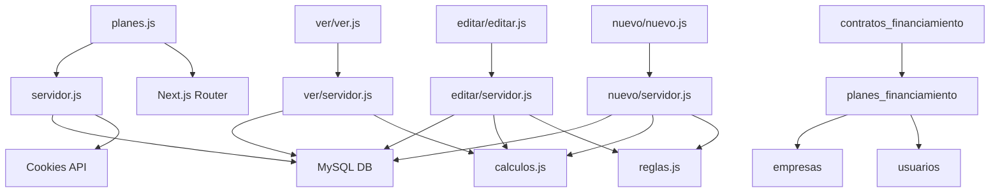
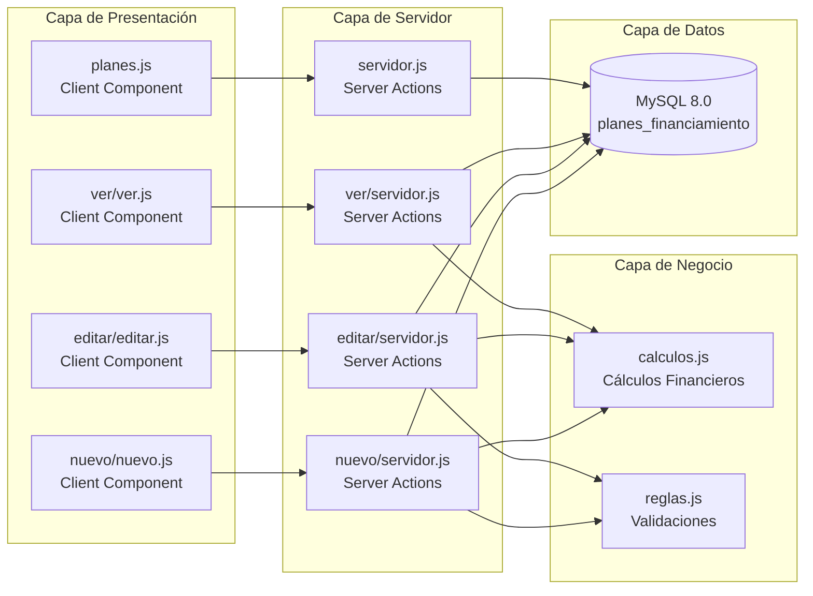
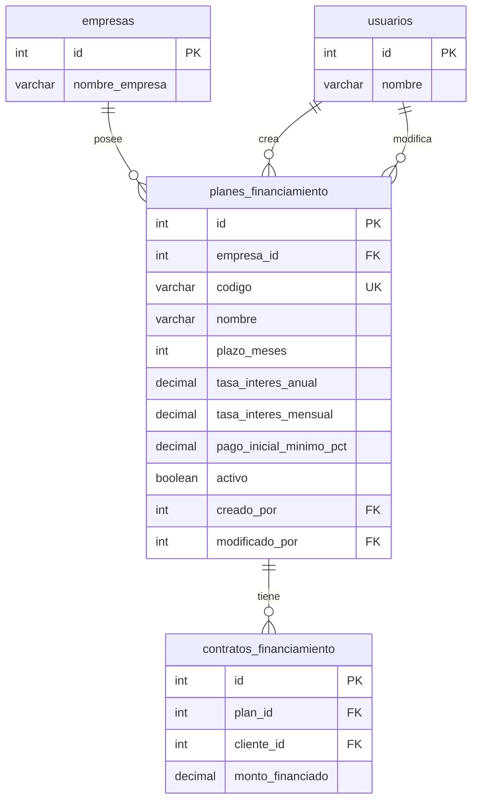
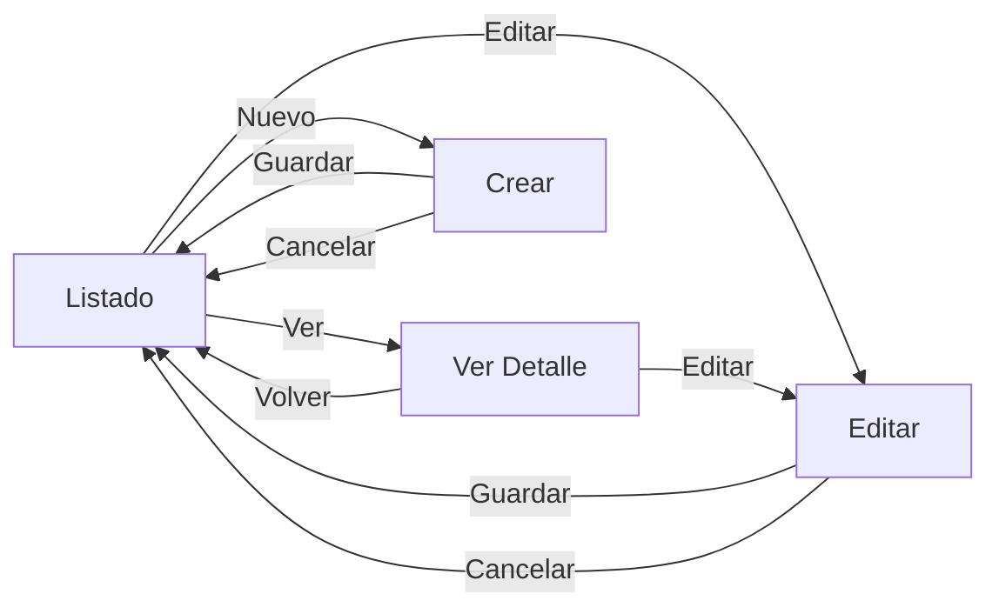
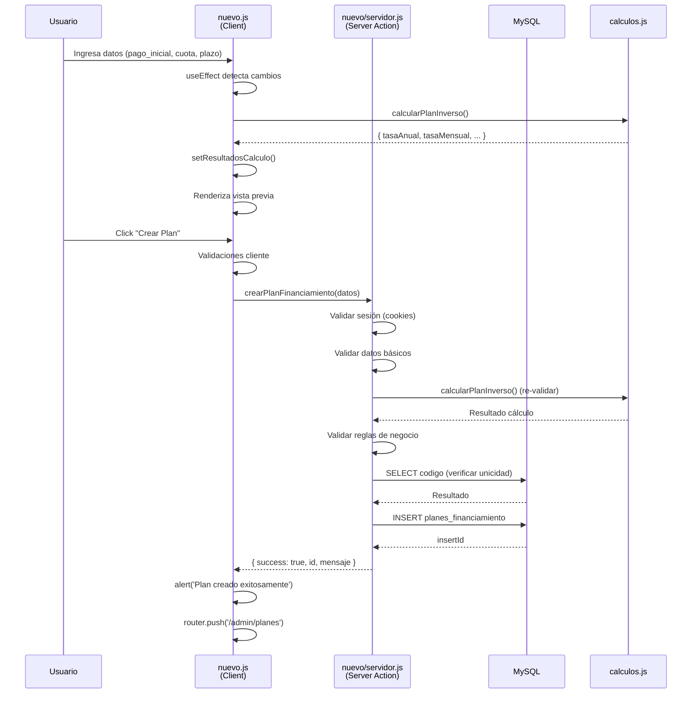
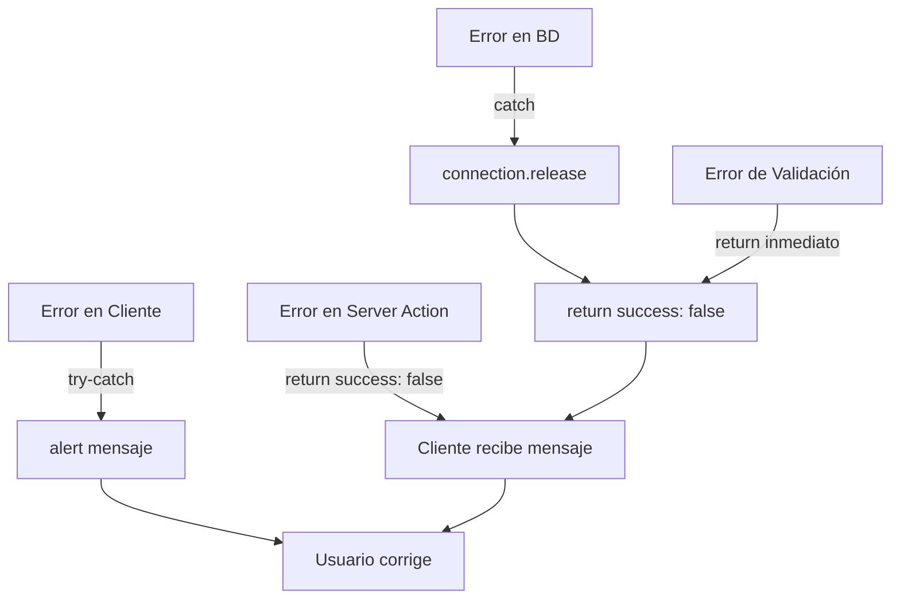

# DOCUMENTACIÓN TÉCNICA DEL MÓDULO DE PLANES DE FINANCIAMIENTO

**Sistema:** Punto de Venta (POS) Multi-Empresa  
**Versión:** 1.0  
**Fecha:** 2025-01-27  
**Autor:** Documentación Técnica  
**Formato:** IEEE 830 - Especificación de Requisitos de Software

---

## TABLA DE CONTENIDOS

1. [Arquitectura del Módulo](#1-arquitectura-del-módulo)
2. [Lógica de Negocio](#2-lógica-de-negocio)
3. [Modelo de Datos](#3-modelo-de-datos)
4. [Capa de Presentación (Frontend)](#4-capa-de-presentación-frontend)
5. [Flujo de Datos Completo](#5-flujo-de-datos-completo)
6. [Análisis Crítico](#6-análisis-crítico)

---

## 1. ARQUITECTURA DEL MÓDULO

### 1.1 Estructura de Carpetas y Archivos

```
_Pages/admin/planes/
├── planes.js                    # Componente principal (listado)
├── planes.module.css            # Estilos del listado (1140 líneas)
├── servidor.js                  # Server Actions del listado
│
├── ver/                         # Submódulo de visualización
│   ├── ver.js                   # Componente de visualización detallada
│   ├── ver.module.css           # Estilos de visualización
│   └── servidor.js              # Server Actions de visualización
│
├── editar/                      # Submódulo de edición
│   ├── editar.js                # Componente de edición
│   ├── editar.module.css        # Estilos de edición
│   └── servidor.js              # Server Actions de edición
│
└── nuevo/                       # Submódulo de creación
    ├── nuevo.js                 # Componente de creación
    ├── nuevo.module.css          # Estilos de creación
    └── servidor.js              # Server Actions de creación
```

### 1.2 Ubicación en el Proyecto

**Rutas Completas:**
- **Frontend (Pages Router):** `/_Pages/admin/planes/`
- **Rutas de Navegación:**
  - Listado: `/admin/planes`
  - Ver: `/admin/planes/ver/[id]`
  - Editar: `/admin/planes/editar/[id]`
  - Nuevo: `/admin/planes/nuevo`

**Dependencias Externas:**
- Base de datos: `@/_DB/db` (MySQL 8.0 connection pool)
- Cálculos financieros: `_Pages/admin/core/finance/calculos.js`
- Validaciones: `_Pages/admin/core/finance/reglas.js`
- Next.js: `next/navigation`, `next/headers`

### 1.3 Dependencias y Relaciones con Otros Módulos



**Relaciones Clave:**
1. **planes_financiamiento** → **empresas**: Relación multi-tenant (empresa_id puede ser NULL para planes globales)
2. **planes_financiamiento** → **usuarios**: Auditoría (creado_por, modificado_por)
3. **contratos_financiamiento** → **planes_financiamiento**: Los contratos referencian planes (no se pueden eliminar planes con contratos activos)

### 1.4 Diagrama de Arquitectura de Componentes



---

## 2. LÓGICA DE NEGOCIO

### 2.1 Caso de Uso: Listar Planes de Financiamiento

#### CU-001: Consultar Lista de Planes

**Descripción:**
Permite al usuario (admin/superadmin) visualizar todos los planes de financiamiento disponibles, con capacidades de filtrado y búsqueda.

**Actor(es):**
- Admin
- Superadmin

**Precondiciones:**
1. Usuario autenticado
2. Cookie `empresaId` válida en la sesión
3. Usuario tiene permisos de administración

**Postcondiciones:**
1. Lista de planes cargada y mostrada
2. Estadísticas calculadas y visualizadas
3. Filtros aplicados correctamente

**Flujo Principal (Comportamiento Actual - CON PROBLEMA DE UX):**

```
1. Usuario accede a /admin/planes
2. Componente planes.js se monta
3. useEffect ejecuta cargarPlanes()
4. cargarPlanes() llama obtenerPlanesFinanciamiento() SIN filtros
5. Server Action obtiene empresaId de cookies
6. Query SQL ejecutada (sin filtros en primera carga)
7. Resultados ordenados: activos primero, luego por fecha_creacion DESC
8. Datos retornados al cliente
9. Estado actualizado: setPlanes(resultado.planes)
10. Usuario escribe en campo de búsqueda o cambia filtro
11. ⚠️ PROBLEMA: setBuscar() o setFiltroActivo() cambia estado
12. ⚠️ useCallback detecta cambio en dependencias [filtroActivo, buscar]
13. ⚠️ cargarPlanes se recrea (nueva función)
14. ⚠️ useEffect detecta que cargarPlanes cambió
15. ⚠️ Se ejecuta cargarPlanes() nuevamente → setCargando(true)
16. ⚠️ Pantalla completa muestra loader (parpadeo)
17. ⚠️ Nueva llamada al backend con filtros
18. ⚠️ Todo el componente se re-renderiza
19. Estadísticas recalculadas (aunque no cambien)
20. Renderizado de cards (aunque los datos sean los mismos)
```

**⚠️ PROBLEMA CRÍTICO DE UX IDENTIFICADO:**

El flujo actual tiene un **anti-pattern** que causa mala experiencia de usuario:

**Causa Raíz:**
```javascript
// planes.js:48-67
const cargarPlanes = useCallback(async () => {
  // ...
}, [filtroActivo, buscar])  // ❌ Dependencias que cambian frecuentemente

useEffect(() => {
  cargarPlanes()
}, [cargarPlanes])  // ❌ Se ejecuta cada vez que cargarPlanes cambia
```

**Consecuencias:**
- Cada tecla en el input de búsqueda dispara una nueva llamada al backend
- Cada cambio de filtro dispara una nueva llamada al backend
- `setCargando(true)` muestra loader en toda la pantalla
- El componente "parpadea" constantemente
- UX pobre y percepción de lentitud

**Flujo Alternativo Recomendado (SOLUCIÓN):**

```
1. Usuario accede a /admin/planes
2. Componente planes.js se monta
3. useEffect ejecuta cargarPlanes() UNA SOLA VEZ (sin dependencias)
4. cargarPlanes() llama obtenerPlanesFinanciamiento() SIN filtros
5. Server Action obtiene empresaId de cookies
6. Query SQL ejecutada (sin filtros)
7. Resultados ordenados: activos primero, luego por fecha_creacion DESC
8. Datos retornados al cliente
9. Estado actualizado: setPlanes(resultado.planes)
10. setCargando(false) → loader desaparece
11. Usuario escribe en campo de búsqueda o cambia filtro
12. ✅ setBuscar() o setFiltroActivo() cambia estado
13. ✅ planesFiltrados se recalcula automáticamente (filtrado en memoria)
14. ✅ Renderizado instantáneo SIN llamadas al backend
15. ✅ Sin loader, sin parpadeos, UX fluida
16. Estadísticas calculadas sobre planesFiltrados
17. Renderizado de cards filtradas
```

**Código de la Solución:**
```javascript
// ✅ Cargar UNA SOLA VEZ al montar
useEffect(() => {
  const cargar = async () => {
    setCargando(true)
    try {
      const resultado = await obtenerPlanesFinanciamiento() // Sin filtros
      if (resultado.success) {
        setPlanes(resultado.planes)
      }
    } finally {
      setCargando(false)
    }
  }
  cargar()
}, []) // ✅ Array vacío = solo al montar

// ✅ Filtrar en memoria (instantáneo)
const planesFiltrados = useMemo(() => {
  return planes.filter(plan => {
    if (filtroActivo === 'activo' && plan.activo !== 1) return false
    if (filtroActivo === 'inactivo' && plan.activo !== 0) return false
    if (buscar && 
        !plan.nombre.toLowerCase().includes(buscar.toLowerCase()) &&
        !plan.codigo.toLowerCase().includes(buscar.toLowerCase())) return false
    return true
  })
}, [planes, filtroActivo, buscar]) // ✅ Solo recalcula si cambian estos valores
```

**Flujos Alternativos:**

**FA-001: Sin planes disponibles**
```
1. Query retorna array vacío
2. Se muestra componente sinDatos
3. Botón "Crear primer plan" visible
```

**FA-002: Error de conexión a BD**
```
1. Excepción capturada en try-catch
2. connection.release() ejecutado
3. Mensaje de error mostrado al usuario
4. Estado planes = []
```

**FA-003: Sesión inválida**
```
1. empresaId no encontrado en cookies
2. Retorna { success: false, mensaje: 'Sesión inválida' }
3. Usuario redirigido a login
```

**Server Action: `obtenerPlanesFinanciamiento`**

**Ubicación:** `_Pages/admin/planes/servidor.js:11`

**Parámetros de Entrada:**
```javascript
{
  activo?: boolean,      // true = solo activos, false = solo inactivos, undefined = todos
  buscar?: string       // Búsqueda en nombre o código (LIKE %buscar%)
}
```

**⚠️ NOTA IMPORTANTE SOBRE USO ACTUAL:**
En el código actual, estos parámetros se envían al backend en cada cambio de filtro/búsqueda, causando el problema de UX documentado en BUG-001. La solución recomendada es **NO enviar estos parámetros** y filtrar solo en el frontend después de cargar todos los planes una vez.

**Proceso de Ejecución:**

```javascript
1. Obtener cookies (Next.js cookies())
2. Extraer empresaId de cookie 'empresaId'
3. Validar empresaId existe
4. Obtener conexión de pool: db.getConnection()
5. Construir query base:
   SELECT p.*, 
          u.nombre as creado_por_nombre,
          u2.nombre as modificado_por_nombre
   FROM planes_financiamiento p
   LEFT JOIN usuarios u ON p.creado_por = u.id
   LEFT JOIN usuarios u2 ON p.modificado_por = u2.id
   WHERE (p.empresa_id = ? OR p.empresa_id IS NULL)
6. Agregar filtros condicionales:
   - Si activo !== undefined: AND p.activo = ?
   - Si buscar existe: AND (p.nombre LIKE ? OR p.codigo LIKE ?)
7. Ordenar: ORDER BY p.activo DESC, p.fecha_creacion DESC
8. Ejecutar query con parámetros
9. Liberar conexión: connection.release()
10. Retornar { success: true, planes: [...] }
```

**Operaciones de Base de Datos:**
- **Query:** SELECT con JOINs a tabla `usuarios` (2 LEFT JOINs)
- **Índices utilizados:** `idx_empresa`, `idx_activo`
- **Transacciones:** No requiere transacción

**Valores de Retorno:**
```javascript
{
  success: boolean,
  planes: Array<{
    id: number,
    codigo: string,
    nombre: string,
    descripcion: string | null,
    plazo_meses: number,
    tasa_interes_anual: number,
    pago_inicial_minimo_pct: number,
    penalidad_mora_pct: number,
    dias_gracia: number,
    activo: 0 | 1,
    creado_por_nombre: string | null,
    modificado_por_nombre: string | null,
    // ... otros campos
  }>,
  mensaje?: string  // Solo si success = false
}
```

**Manejo de Errores:**
- **Error de conexión:** `connection.release()` en finally, retorna `{ success: false, mensaje: 'Error al cargar planes', planes: [] }`
- **Sesión inválida:** Retorna inmediatamente sin query
- **Errores SQL:** Capturados en catch, logged en console.error

---

### 2.2 Caso de Uso: Crear Nuevo Plan (Flujo Inverso)

#### CU-002: Crear Plan de Financiamiento

**Descripción:**
Permite crear un nuevo plan de financiamiento usando un flujo inverso donde el usuario ingresa montos concretos (pago inicial, cuota mensual, plazo) y el sistema calcula automáticamente la tasa de interés.

**Actor(es):**
- Admin
- Superadmin

**Precondiciones:**
1. Usuario autenticado
2. Cookies `empresaId` y `userId` válidas
3. Usuario tiene permisos de administración

**Postcondiciones:**
1. Plan creado en base de datos
2. Tasa de interés calculada y almacenada
3. Usuario redirigido a listado de planes

**Flujo Principal:**

```
1. Usuario accede a /admin/planes/nuevo
2. Componente nuevo.js se monta
3. Usuario ingresa:
   - Código (único)
   - Nombre
   - Pago inicial (RD$)
   - Cuota mensual (RD$)
   - Plazo (meses)
   - Fecha primer pago
4. useEffect con debounce (400ms) detecta cambios
5. calcularPlanInverso() ejecutado automáticamente
6. Resultados mostrados en tiempo real:
   - Tasa anual efectiva
   - Tasa mensual
   - Monto financiado
   - Precio total
   - Porcentaje inicial
7. Usuario completa campos adicionales:
   - Penalidades
   - Descuentos
   - Configuración
8. Usuario hace clic en "Crear Plan"
9. Validaciones del lado del cliente
10. guardarPlan() ejecuta crearPlanFinanciamiento()
11. Server Action valida y calcula
12. INSERT en base de datos
13. Redirección a /admin/planes
```

**Flujos Alternativos:**

**FA-001: Cálculo inválido**
```
1. calcularPlanInverso retorna { valido: false }
2. Botón "Crear Plan" deshabilitado
3. Mensaje de error visible
4. Usuario ajusta valores
```

**FA-002: Código duplicado**
```
1. Server Action verifica unicidad
2. Retorna { success: false, mensaje: 'El código del plan ya existe' }
3. Usuario debe cambiar código
```

**FA-003: Tasa muy alta (>200%)**
```
1. Sistema detecta tasa > 200%
2. Confirmación requerida: "¿Desea continuar?"
3. Si confirma, se crea con advertencia en descripción
```

**Server Action: `crearPlanFinanciamiento`**

**Ubicación:** `_Pages/admin/planes/nuevo/servidor.js:21`

**Parámetros de Entrada:**
```javascript
{
  codigo: string,                    // REQUERIDO, único
  nombre: string,                    // REQUERIDO
  descripcion?: string,
  
  // FLUJO INVERSO (prioritario)
  pago_inicial?: number,             // Monto en RD$
  cuota_mensual?: number,            // Monto en RD$
  plazo_meses: number,               // REQUERIDO
  
  // FLUJO TRADICIONAL (alternativo)
  tasa_interes_anual?: number,
  tasa_interes_mensual?: number,
  pago_inicial_minimo_pct?: number,
  
  // Fechas
  fecha_primer_pago?: string,        // YYYY-MM-DD
  dia_pago_mensual?: number,         // 1-31
  
  // Configuración
  monto_minimo?: number,
  monto_maximo?: number | null,
  penalidad_mora_pct?: number,
  dias_gracia?: number,
  descuento_pago_anticipado_pct?: number,
  cuotas_minimas_anticipadas?: number,
  activo?: boolean,
  permite_pago_anticipado?: boolean,
  requiere_fiador?: boolean
}
```

**Proceso de Ejecución Detallado:**

```javascript
// PASO 1: Validación de sesión
1. Obtener cookies: empresaId, userId
2. Validar ambos existen
3. Si no: return { success: false, mensaje: 'Sesión inválida' }

// PASO 2: Validaciones básicas
4. Validar codigo y nombre existen
5. Validar plazo usando validarPlazo(plazo_meses)

// PASO 3: FLUJO INVERSO (si vienen montos concretos)
6. Si (pago_inicial && cuota_mensual && plazo_meses):
   a. Llamar calcularPlanInverso(pago_inicial, cuota_mensual, plazo_meses)
   b. Validar resultado.valido
   c. Extraer:
      - tasaAnual = resultado.tasaAnualEfectiva
      - tasaMensual = resultado.tasaMensual
      - pagoInicialMinimoPct = resultado.porcentajeInicial
   d. Si tasaAnual > 200: warning en console (permitir)

// PASO 4: FLUJO TRADICIONAL (alternativo)
7. Si no hay flujo inverso:
   a. Validar tasa_interes_anual existe y > 0
   b. Calcular tasaMensual = tasaAnualAMensual(tasaAnual)
   c. Usar pago_inicial_minimo_pct o default 15.00

// PASO 5: Validaciones de negocio
8. Validar penalidad_mora_pct: validarTasaMora()
9. Validar dias_gracia: validarDiasGracia()
10. Validar montos: validarMontoFinanciable()
11. Validar monto_maximo > monto_minimo (si ambos existen)
12. Validar fecha_primer_pago >= hoy
13. Validar dia_pago_mensual entre 1-31

// PASO 6: Validación de unicidad
14. Obtener conexión: db.getConnection()
15. Query: SELECT id FROM planes_financiamiento WHERE codigo = ?
16. Si existe: return { success: false, mensaje: 'Código duplicado' }

// PASO 7: Preparar descripción
17. Si flujo inverso:
    Agregar metadata a descripción:
    - Pago inicial ejemplo
    - Cuota mensual
    - Tasa calculada
    - Montos ejemplo

// PASO 8: INSERT en base de datos
18. Construir query dinámico (verificar campo dia_pago_mensual)
19. Valores:
    - empresa_id: empresaId
    - codigo, nombre, descripcion
    - plazo_meses
    - tasa_interes_anual, tasa_interes_mensual
    - pago_inicial_minimo_pct
    - monto_minimo, monto_maximo
    - penalidad_mora_pct, dias_gracia
    - descuento_pago_anticipado_pct, cuotas_minimas_anticipadas
    - activo, permite_pago_anticipado, requiere_fiador
    - creado_por: userId
20. Ejecutar INSERT
21. connection.release()
22. Return { success: true, id: result.insertId, mensaje: 'Plan creado exitosamente' }
```

**Operaciones de Base de Datos:**

**Query INSERT:**
```sql
INSERT INTO planes_financiamiento (
    empresa_id, codigo, nombre, descripcion, plazo_meses,
    tasa_interes_anual, tasa_interes_mensual, pago_inicial_minimo_pct,
    monto_minimo, monto_maximo, penalidad_mora_pct, dias_gracia,
    descuento_pago_anticipado_pct, cuotas_minimas_anticipadas,
    activo, permite_pago_anticipado, requiere_fiador,
    creado_por
    [, dia_pago_mensual]  -- Si campo existe
) VALUES (?, ?, ?, ?, ?, ?, ?, ?, ?, ?, ?, ?, ?, ?, ?, ?, ?, ? [, ?])
```

**Índices utilizados:**
- `idx_codigo` (UNIQUE) - Validación de unicidad
- `idx_empresa` - Filtrado por empresa

**Transacciones:** No requiere transacción (operación atómica)

**Valores de Retorno:**
```javascript
{
  success: boolean,
  id?: number,              // insertId del plan creado
  mensaje: string,
  datosCalculados?: {        // Solo si success = true
    tasaAnual: number,
    tasaMensual: number,
    pagoInicialMinimoPct: number
  }
}
```

**Manejo de Errores:**

| Error | Acción | Retorno |
|-------|--------|---------|
| Sesión inválida | Validación temprana | `{ success: false, mensaje: 'Sesión inválida' }` |
| Código/nombre faltantes | Validación | `{ success: false, mensaje: 'Código y nombre son obligatorios' }` |
| Cálculo inválido | Validación de resultado | `{ success: false, mensaje: resultado.error }` |
| Código duplicado | Query SELECT | `{ success: false, mensaje: 'El código del plan ya existe' }` |
| Error SQL | Try-catch | `{ success: false, mensaje: 'Error al crear plan: ' + error.message }` |
| Conexión no liberada | Finally block | `connection.release()` siempre ejecutado |

---

### 2.3 Caso de Uso: Editar Plan Existente

#### CU-003: Modificar Plan de Financiamiento

**Descripción:**
Permite modificar los parámetros de un plan existente, excepto el código (inmutable).

**Actor(es):**
- Admin
- Superadmin

**Precondiciones:**
1. Plan existe en base de datos
2. Plan pertenece a la empresa del usuario (o es global)
3. Usuario autenticado con permisos

**Postcondiciones:**
1. Plan actualizado en base de datos
2. Campo `modificado_por` actualizado
3. Campo `fecha_actualizacion` actualizado automáticamente

**Flujo Principal:**

```
1. Usuario accede a /admin/planes/editar/[id]
2. Componente editar.js se monta
3. useEffect ejecuta cargarPlan()
4. obtenerPlanPorId(id) obtiene datos del plan
5. Formulario pre-poblado con datos actuales
6. Usuario modifica campos (excepto código)
7. Vista previa actualizada en tiempo real
8. Usuario hace clic en "Actualizar Plan"
9. actualizarPlanFinanciamiento(id, formData) ejecutado
10. Validaciones en servidor
11. UPDATE en base de datos
12. Redirección a /admin/planes
```

**Server Action: `actualizarPlanFinanciamiento`**

**Ubicación:** `_Pages/admin/planes/editar/servidor.js:62`

**Parámetros de Entrada:**
```javascript
id: number,                    // ID del plan a actualizar
datos: {
  nombre?: string,
  descripcion?: string,
  codigo?: string,              // Solo para validar unicidad si cambia
  plazo_meses?: number,
  tasa_interes_anual?: number,
  pago_inicial_minimo_pct?: number,
  monto_minimo?: number,
  monto_maximo?: number | null,
  penalidad_mora_pct?: number,
  dias_gracia?: number,
  descuento_pago_anticipado_pct?: number,
  cuotas_minimas_anticipadas?: number,
  activo?: boolean,
  permite_pago_anticipado?: boolean,
  requiere_fiador?: boolean
}
```

**Proceso de Ejecución:**

```javascript
// PASO 1: Validación de sesión
1. Obtener empresaId, userId de cookies
2. Validar ambos existen

// PASO 2: Verificar existencia y propiedad
3. Query: SELECT id FROM planes_financiamiento 
          WHERE id = ? AND (empresa_id = ? OR empresa_id IS NULL)
4. Si no existe: return { success: false, mensaje: 'Plan no encontrado' }

// PASO 3: Validaciones de negocio
5. Si tasa_interes_anual: validarTasaInteres()
6. Si plazo_meses: validarPlazo()
7. Si pago_inicial_minimo_pct: validarPagoInicialPct()
8. Si penalidad_mora_pct: validarTasaMora()
9. Si dias_gracia: validarDiasGracia()

// PASO 4: Validar unicidad de código (si cambia)
10. Si codigo existe:
    Query: SELECT id FROM planes_financiamiento 
           WHERE codigo = ? AND id != ?
11. Si existe: return { success: false, mensaje: 'Código duplicado' }

// PASO 5: Construir UPDATE dinámico
12. Array campos = []
13. Array valores = []
14. Por cada campo en datos:
    - Si existe: agregar 'campo = ?' a campos
    - Agregar valor a valores
15. Si tasa_interes_anual cambia:
    - Calcular tasaMensual = tasaAnualAMensual(tasaAnual)
    - Agregar ambos campos
16. Agregar modificado_por = userId
17. Agregar id al final de valores

// PASO 6: Ejecutar UPDATE
18. Query: UPDATE planes_financiamiento 
          SET ${campos.join(', ')} 
          WHERE id = ?
19. connection.release()
20. Return { success: true, mensaje: 'Plan actualizado exitosamente' }
```

**Query UPDATE Dinámico:**
```sql
UPDATE planes_financiamiento 
SET nombre = ?, 
    descripcion = ?,
    plazo_meses = ?,
    tasa_interes_anual = ?,
    tasa_interes_mensual = ?,
    -- ... otros campos modificados
    modificado_por = ?
WHERE id = ?
```

**Reglas de Negocio Especiales:**
- Si `tasa_interes_anual` cambia, `tasa_interes_mensual` se recalcula automáticamente
- El código NO se puede modificar (aunque viene en datos, no se actualiza)
- Solo se actualizan los campos que vienen en `datos` (UPDATE parcial)

---

### 2.4 Caso de Uso: Visualizar Plan Detallado

#### CU-004: Consultar Detalles de Plan

**Descripción:**
Muestra información completa de un plan, incluyendo simulador de financiamiento con ejemplo.

**Actor(es):**
- Admin
- Superadmin

**Server Action: `obtenerPlanPorId`**

**Ubicación:** `_Pages/admin/planes/ver/servidor.js:11` y `_Pages/admin/planes/editar/servidor.js:20`

**Query:**
```sql
SELECT p.*, 
       u.nombre as creado_por_nombre,
       u2.nombre as modificado_por_nombre
FROM planes_financiamiento p
LEFT JOIN usuarios u ON p.creado_por = u.id
LEFT JOIN usuarios u2 ON p.modificado_por = u2.id
WHERE p.id = ? AND (p.empresa_id = ? OR p.empresa_id IS NULL)
```

**Cálculo de Ejemplo de Cuota (Frontend):**

```javascript
// Ubicación: ver/ver.js:81
function calcularEjemploCuota() {
  const montoEjemplo = 100000  // RD$100,000 fijo
  const pagoInicial = montoEjemplo * (plan.pago_inicial_minimo_pct / 100)
  const montoFinanciado = montoEjemplo - pagoInicial
  const tasaMensual = tasaAnualAMensual(plan.tasa_interes_anual)
  const factor = Math.pow(1 + tasaMensual, plan.plazo_meses)
  const cuota = montoFinanciado * (tasaMensual * factor) / (factor - 1)
  const totalIntereses = (cuota * plan.plazo_meses) - montoFinanciado
  const totalPagar = cuota * plan.plazo_meses
  
  return {
    precioProducto: montoEjemplo,
    pagoInicial,
    montoFinanciado,
    cuotaMensual: cuota,
    totalIntereses,
    totalPagar,
    totalConInicial: totalPagar + pagoInicial
  }
}
```

**Fórmula de Cuota (Sistema Francés):**
```
Cuota = MontoFinanciado × [r × (1+r)^n] / [(1+r)^n - 1]

Donde:
- r = tasa mensual (tasa_anual / 12 / 100)
- n = número de cuotas (plazo_meses)
```

---

### 2.5 Caso de Uso: Eliminar/Desactivar Plan

#### CU-005: Eliminar Plan de Financiamiento

**Descripción:**
Elimina un plan si no tiene contratos asociados, o lo desactiva si tiene contratos.

**Actor(es):**
- Admin
- Superadmin

**Server Action: `eliminarPlanFinanciamiento`**

**Ubicación:** `_Pages/admin/planes/servidor.js:65`

**Proceso:**

```javascript
1. Validar sesión (empresaId, userId)
2. Verificar plan existe y pertenece a empresa
3. Query: SELECT COUNT(*) as total 
          FROM contratos_financiamiento 
          WHERE plan_id = ?
4. Si total > 0:
   - UPDATE planes_financiamiento 
     SET activo = 0, modificado_por = ? 
     WHERE id = ?
   - Return { success: true, mensaje: 'Plan desactivado (tiene contratos asociados)' }
5. Si total = 0:
   - DELETE FROM planes_financiamiento WHERE id = ?
   - Return { success: true, mensaje: 'Plan eliminado exitosamente' }
```

**Regla de Negocio Crítica:**
- **NO se puede eliminar físicamente** un plan que tiene contratos asociados
- Se desactiva automáticamente (`activo = 0`)
- Esto preserva la integridad referencial histórica

---

### 2.6 Reglas de Negocio

#### 2.6.1 Reglas de Validación de Datos

| Campo | Regla | Validación | Ubicación |
|-------|-------|------------|-----------|
| `codigo` | Único en toda la BD | Query SELECT antes de INSERT/UPDATE | `servidor.js` |
| `codigo` | No modificable | No incluido en UPDATE | `editar/servidor.js` |
| `nombre` | Requerido | Validación en servidor | Todos los servidor.js |
| `plazo_meses` | Entre 1 y 60 | `validarPlazo()` | `reglas.js` |
| `tasa_interes_anual` | Entre 0 y 100% | `validarTasaInteres()` | `reglas.js` |
| `pago_inicial_minimo_pct` | Entre 0 y 100% | `validarPagoInicialPct()` | `reglas.js` |
| `penalidad_mora_pct` | Entre 0 y 100% | `validarTasaMora()` | `reglas.js` |
| `dias_gracia` | Entre 0 y 30 | `validarDiasGracia()` | `reglas.js` |
| `monto_minimo` | >= 0 | `validarMontoFinanciable()` | `reglas.js` |
| `monto_maximo` | > monto_minimo (si ambos existen) | Validación lógica | `nuevo/servidor.js:124` |
| `fecha_primer_pago` | >= hoy | Validación de fecha | `nuevo/servidor.js:136` |
| `dia_pago_mensual` | Entre 1 y 31 | Validación numérica | `nuevo/servidor.js:200` |

#### 2.6.2 Reglas de Autorización y Permisos

| Acción | Permiso Requerido | Validación |
|--------|-------------------|------------|
| Listar planes | Admin o Superadmin | Cookie `empresaId` válida |
| Ver plan | Admin o Superadmin | Plan pertenece a empresa o es global |
| Crear plan | Admin o Superadmin | Cookie `userId` válida |
| Editar plan | Admin o Superadmin | Plan pertenece a empresa o es global |
| Eliminar plan | Admin o Superadmin | Plan pertenece a empresa o es global |

**Nota:** No hay validación explícita de roles. Se asume que el acceso a `/admin/planes` ya está protegido por middleware de autenticación.

#### 2.6.3 Reglas de Cálculo

**Cálculo de Tasa Mensual:**
```javascript
// Ubicación: _Pages/admin/core/finance/calculos.js:298
tasaMensual = tasaAnual / 12 / 100

// Ejemplo: 18% anual = 1.5% mensual
```

**Cálculo de Cuota (Sistema Francés):**
```javascript
// Ubicación: ver/ver.js:89
factor = (1 + tasaMensual) ^ plazo_meses
cuota = montoFinanciado × (tasaMensual × factor) / (factor - 1)
```

**Cálculo Inverso (Flujo Nuevo Plan):**
```javascript
// Ubicación: _Pages/admin/core/finance/calculos.js:566
// Algoritmo iterativo híbrido (Bisección + Newton-Raphson)
// Entrada: pagoInicial, cuotaMensual, numeroCuotas
// Salida: tasaAnualEfectiva, tasaMensual, montoFinanciado, precioTotal
```

#### 2.6.4 Restricciones y Condiciones Especiales

1. **Planes Globales vs Empresa:**
   - `empresa_id = NULL` → Plan global (superadmin)
   - `empresa_id = X` → Plan específico de empresa
   - Query siempre incluye: `WHERE (empresa_id = ? OR empresa_id IS NULL)`

2. **Eliminación de Planes:**
   - Si tiene contratos: Solo desactivar (`activo = 0`)
   - Si no tiene contratos: Eliminación física permitida

3. **Tasa Muy Alta:**
   - Si tasa calculada > 200%: Advertencia pero permitido
   - Se registra en descripción del plan

4. **Porcentaje Inicial Bajo:**
   - Si < 5%: Advertencia en creación
   - No bloquea la creación

5. **Campo `dia_pago_mensual`:**
   - Opcional en base de datos
   - Se verifica existencia antes de INSERT
   - Si no existe columna, se omite

#### 2.6.5 Reglas de Integridad de Datos

**Constraints de Base de Datos:**
```sql
FOREIGN KEY (empresa_id) REFERENCES empresas(id) ON DELETE CASCADE
FOREIGN KEY (creado_por) REFERENCES usuarios(id)
FOREIGN KEY (modificado_por) REFERENCES usuarios(id) ON DELETE SET NULL
UNIQUE (codigo)
```

**Validaciones a Nivel de Aplicación:**
- Código único (validado antes de INSERT/UPDATE)
- Monto máximo > monto mínimo
- Fecha primer pago >= hoy
- Integridad referencial con `contratos_financiamiento`

---

## 3. MODELO DE DATOS

### 3.1 Entidad: `planes_financiamiento`

**Tabla:** `planes_financiamiento`  
**Motor:** InnoDB  
**Charset:** utf8mb4  
**Collation:** utf8mb4_unicode_ci

#### 3.1.1 Campos y Tipos de Datos

| Campo | Tipo | Null | Default | Descripción |
|-------|------|------|---------|-------------|
| `id` | INT(11) | NO | AUTO_INCREMENT | Primary Key |
| `empresa_id` | INT(11) | YES | NULL | NULL = plan global del superadmin |
| `codigo` | VARCHAR(20) | NO | - | Código único del plan |
| `nombre` | VARCHAR(100) | NO | - | Nombre descriptivo |
| `descripcion` | TEXT | YES | NULL | Descripción detallada |
| `plazo_meses` | INT(11) | NO | - | Plazo en meses (6, 12, 18, 24, etc.) |
| `tasa_interes_anual` | DECIMAL(5,2) | NO | - | Tasa anual en % (ej: 18.00) |
| `tasa_interes_mensual` | DECIMAL(5,4) | NO | 0.0100 | Tasa mensual calculada |
| `pago_inicial_minimo_pct` | DECIMAL(5,2) | NO | 15.00 | % mínimo de pago inicial |
| `monto_minimo` | DECIMAL(12,2) | YES | 0.00 | Monto mínimo financiable |
| `monto_maximo` | DECIMAL(12,2) | YES | NULL | Monto máximo financiable |
| `penalidad_mora_pct` | DECIMAL(5,2) | NO | 5.00 | % de penalidad por mora |
| `dias_gracia` | INT(11) | NO | 5 | Días de gracia antes de aplicar mora |
| `descuento_pago_anticipado_pct` | DECIMAL(5,2) | YES | 0.00 | % descuento por pago anticipado |
| `cuotas_minimas_anticipadas` | DECIMAL(5,2) | YES | 3.00 | Mínimo de cuotas para descuento |
| `activo` | TINYINT(1) | YES | 1 | 1=activo, 0=inactivo |
| `permite_pago_anticipado` | TINYINT(1) | YES | 1 | Permite pagos anticipados |
| `requiere_fiador` | TINYINT(1) | YES | 0 | Requiere fiador |
| `creado_por` | INT(11) | NO | - | ID del usuario creador |
| `modificado_por` | INT(11) | YES | NULL | ID del último modificador |
| `fecha_creacion` | TIMESTAMP | NO | CURRENT_TIMESTAMP | Fecha de creación |
| `fecha_actualizacion` | TIMESTAMP | NO | CURRENT_TIMESTAMP ON UPDATE | Fecha última actualización |
| `dia_pago_mensual` | INT(11) | YES | NULL | Día del mes para pagos (1-31) |

**Nota:** El campo `dia_pago_mensual` puede no existir en todas las instalaciones (se verifica dinámicamente).

#### 3.1.2 Índices

| Nombre | Tipo | Campos | Propósito |
|--------|------|--------|-----------|
| `PRIMARY` | PRIMARY KEY | `id` | Identificador único |
| `idx_empresa` | INDEX | `empresa_id` | Filtrado por empresa |
| `idx_codigo` | UNIQUE | `codigo` | Garantizar unicidad |
| `idx_activo` | INDEX | `activo` | Filtrado por estado |
| `idx_plazo` | INDEX | `plazo_meses` | Búsquedas por plazo |

#### 3.1.3 Constraints (Foreign Keys)

| Constraint | Tabla Referenciada | Campo | On Delete | On Update |
|------------|-------------------|-------|----------|-----------|
| `FK_empresa` | `empresas` | `id` | CASCADE | RESTRICT |
| `FK_creado_por` | `usuarios` | `id` | RESTRICT | RESTRICT |
| `FK_modificado_por` | `usuarios` | `id` | SET NULL | RESTRICT |

#### 3.1.4 Relaciones



**Cardinalidades:**
- `empresas` 1:N `planes_financiamiento` (una empresa puede tener muchos planes)
- `usuarios` 1:N `planes_financiamiento` (un usuario puede crear muchos planes)
- `planes_financiamiento` 1:N `contratos_financiamiento` (un plan puede tener muchos contratos)

**Reglas de Relación:**
- Si se elimina una empresa, se eliminan sus planes (CASCADE)
- Si se elimina un usuario creador, NO se puede eliminar el plan (RESTRICT)
- Si se elimina un usuario modificador, se pone NULL (SET NULL)
- Un plan con contratos NO se puede eliminar físicamente

---

## 4. CAPA DE PRESENTACIÓN (FRONTEND)

### 4.1 Componente Principal: `planes.js`

**Ubicación:** `_Pages/admin/planes/planes.js`  
**Tipo:** Client Component (`"use client"`)  
**Líneas:** 338

#### 4.1.1 Props Recibidos

Este componente no recibe props. Obtiene datos mediante Server Actions.

#### 4.1.2 Estado Local

```javascript
const [tema, setTema] = useState('light')              // Tema claro/oscuro
const [cargando, setCargando] = useState(true)       // Estado de carga
const [planes, setPlanes] = useState([])              // Lista de planes
const [filtroActivo, setFiltroActivo] = useState('') // Filtro por estado
const [buscar, setBuscar] = useState('')              // Búsqueda por texto
```

#### 4.1.3 Hooks Utilizados

**useEffect (2 instancias):**

1. **Manejo de tema:**
```javascript
useEffect(() => {
  const temaLocal = localStorage.getItem('tema') || 'light'
  setTema(temaLocal)
  
  const manejarCambioTema = () => {
    const nuevoTema = localStorage.getItem('tema') || 'light'
    setTema(nuevoTema)
  }
  
  window.addEventListener('temaChange', manejarCambioTema)
  window.addEventListener('storage', manejarCambioTema)
  
  return () => {
    window.removeEventListener('temaChange', manejarCambioTema)
    window.removeEventListener('storage', manejarCambioTema)
  }
}, [])
```

2. **Carga de planes:**
```javascript
useEffect(() => {
  cargarPlanes()
}, [cargarPlanes])
```

**useCallback:**
```javascript
const cargarPlanes = useCallback(async () => {
  setCargando(true)
  try {
    const resultado = await obtenerPlanesFinanciamiento({
      activo: filtroActivo === 'activo' ? true : 
             filtroActivo === 'inactivo' ? false : undefined,
      buscar: buscar || undefined
    })
    if (resultado.success) {
      setPlanes(resultado.planes)
    } else {
      alert(resultado.mensaje || 'Error al cargar planes')
    }
  } catch (error) {
    console.error('Error al cargar planes:', error)
    alert('Error al cargar planes')
  } finally {
    setCargando(false)
  }
}, [filtroActivo, buscar])
```

**useRouter:**
```javascript
const router = useRouter()
```

#### 4.1.4 Estructura JSX

```jsx
<div className={estilos.contenedor}>
  {/* Header */}
  <div className={estilos.header}>
    <div className={estilos.headerTitulo}>
      <CreditCard icon />
      <h1>Planes de Financiamiento</h1>
      <p>Subtítulo</p>
    </div>
    <button onClick={navegarANuevo}>Nuevo Plan</button>
  </div>

  {/* Estadísticas (4 cards) */}
  <div className={estilos.estadisticas}>
    <Card>Total Planes</Card>
    <Card>Planes Activos</Card>
    <Card>Tasa Promedio</Card>
    <Card>Inactivos</Card>
  </div>

  {/* Filtros */}
  <div className={estilos.filtros}>
    <input type="text" placeholder="Buscar..." />
    <select>Filtro por estado</select>
  </div>

  {/* Lista de Planes */}
  <div className={estilos.listaPlanes}>
    {planesFiltrados.map(plan => (
      <PlanCard key={plan.id} plan={plan} />
    ))}
  </div>
</div>
```

#### 4.1.5 Funciones de Navegación

```javascript
const navegarANuevo = () => router.push('/admin/planes/nuevo')
const navegarAEditar = (planId) => router.push(`/admin/planes/editar/${planId}`)
const navegarAVer = (planId) => router.push(`/admin/planes/ver/${planId}`)
```

#### 4.1.6 Cálculo de Estadísticas

```javascript
const estadisticas = {
  total: planes.length,
  activos: planes.filter(p => p.activo === 1).length,
  inactivos: planes.filter(p => p.activo === 0).length,
  tasaPromedio: planes.length > 0 
    ? (planes.reduce((sum, p) => sum + parseFloat(p.tasa_interes_anual || 0), 0) / planes.length).toFixed(2)
    : 0
}
```

#### 4.1.7 Filtrado de Planes

```javascript
const planesFiltrados = planes.filter(plan => {
  if (filtroActivo === 'activo' && plan.activo !== 1) return false
  if (filtroActivo === 'inactivo' && plan.activo !== 0) return false
  if (buscar && !plan.nombre.toLowerCase().includes(buscar.toLowerCase()) &&
      !plan.codigo.toLowerCase().includes(buscar.toLowerCase())) return false
  return true
})
```

**Nota:** El filtrado se hace en el cliente después de cargar todos los planes. Para grandes volúmenes, sería mejor hacerlo en el servidor.

---

### 4.2 Componente: `nuevo.js`

**Ubicación:** `_Pages/admin/planes/nuevo/nuevo.js`  
**Tipo:** Client Component  
**Líneas:** 1034

#### 4.2.1 Estado Local Complejo

```javascript
const [formData, setFormData] = useState({
  // Información básica
  codigo: '',
  nombre: '',
  descripcion: '',
  
  // FLUJO INVERSO (entrada del usuario)
  pago_inicial: 6500,
  plazo_meses: 12,
  cuota_mensual: 3200,
  
  // Fechas
  fecha_primer_pago: '',
  dia_pago_mensual: null,
  
  // Configuración adicional
  monto_minimo: 0,
  monto_maximo: null,
  penalidad_mora_pct: 5.00,
  dias_gracia: 5,
  descuento_pago_anticipado_pct: 0,
  cuotas_minimas_anticipadas: 3,
  activo: true,
  permite_pago_anticipado: true,
  requiere_fiador: false
})

const [resultadosCalculo, setResultadosCalculo] = useState(null)
const [cronogramaFechas, setCronogramaFechas] = useState([])
const [calculando, setCalculando] = useState(false)
```

#### 4.2.2 Cálculo Automático con Debounce

```javascript
useEffect(() => {
  if (formData.pago_inicial > 0 && formData.cuota_mensual > 0 && formData.plazo_meses > 0) {
    setCalculando(true)
    
    const timeoutId = setTimeout(() => {
      try {
        const resultado = calcularPlanInverso(
          formData.pago_inicial,
          formData.cuota_mensual,
          formData.plazo_meses
        )
        
        if (resultado.valido) {
          setResultadosCalculo(resultado)
        } else {
          setResultadosCalculo(null)
        }
      } catch (error) {
        console.error('Error al calcular:', error)
        setResultadosCalculo(null)
      } finally {
        setCalculando(false)
      }
    }, 400) // Debounce de 400ms
    
    return () => clearTimeout(timeoutId)
  } else {
    setResultadosCalculo(null)
    setCalculando(false)
  }
}, [formData.pago_inicial, formData.cuota_mensual, formData.plazo_meses])
```

**Razón del Debounce:**
- Evita cálculos excesivos mientras el usuario escribe
- Mejora performance en inputs numéricos
- 400ms es un balance entre responsividad y eficiencia

#### 4.2.3 Generación de Cronograma

```javascript
useEffect(() => {
  if (formData.fecha_primer_pago && formData.plazo_meses > 0 && resultadosCalculo?.valido) {
    try {
      const cronograma = generarCronogramaFechas(
        formData.fecha_primer_pago,
        formData.plazo_meses,
        formData.dia_pago_mensual,
        formData.dias_gracia
      )
      setCronogramaFechas(cronograma)
    } catch (error) {
      console.error('Error al generar cronograma:', error)
      setCronogramaFechas([])
    }
  } else {
    setCronogramaFechas([])
  }
}, [formData.fecha_primer_pago, formData.plazo_meses, formData.dia_pago_mensual, formData.dias_gracia, resultadosCalculo])
```

#### 4.2.4 Validaciones del Lado del Cliente

```javascript
const guardarPlan = async () => {
  // Validaciones básicas
  if (!formData.codigo || !formData.nombre) {
    alert('Por favor complete el código y nombre del plan')
    return
  }

  if (!resultadosCalculo || !resultadosCalculo.valido) {
    alert('Por favor verifique los datos de financiamiento. El cálculo no es válido.')
    return
  }

  if (!formData.fecha_primer_pago) {
    alert('Por favor seleccione la fecha del primer pago')
    return
  }

  // Validar tasa razonable
  if (resultadosCalculo.tasaAnualEfectiva > 200) {
    const confirmar = confirm(
      `La tasa de interés calculada es muy alta (${resultadosCalculo.tasaAnualEfectiva.toFixed(2)}%). ` +
      '¿Desea continuar de todas formas?'
    )
    if (!confirmar) return
  }

  // ... resto del proceso
}
```

#### 4.2.5 Estructura del Formulario

El formulario está dividido en 5 secciones:

1. **Información Básica:** Código, nombre, descripción
2. **Términos de Financiamiento:** Flujo inverso (2 columnas: entrada | resultados)
3. **Fechas de Pago:** Fecha primer pago, día mensual, cronograma
4. **Penalidades y Descuentos:** Mora, días gracia, descuentos
5. **Configuración Adicional:** Montos, toggles (activo, pago anticipado, fiador)

**Layout:** 2 columnas (formulario izquierda | vista previa derecha)

---

### 4.3 Componente: `editar.js`

**Ubicación:** `_Pages/admin/planes/editar/editar.js`  
**Tipo:** Client Component  
**Líneas:** 732

#### 4.3.1 Carga de Datos Existentes

```javascript
useEffect(() => {
  const cargarPlan = async () => {
    if (!id) return

    setCargando(true)
    setError(null)
    try {
      const resultado = await obtenerPlanPorId(id)

      if (resultado.success && resultado.plan) {
        const plan = resultado.plan
        setFormData({
          codigo: plan.codigo,
          nombre: plan.nombre,
          descripcion: plan.descripcion || '',
          plazo_meses: plan.plazo_meses,
          tasa_interes_anual: plan.tasa_interes_anual,
          // ... mapeo completo
          activo: plan.activo === 1,
          permite_pago_anticipado: plan.permite_pago_anticipado === 1,
          requiere_fiador: plan.requiere_fiador === 1
        })
      } else {
        setError(resultado.mensaje || 'Plan no encontrado')
      }
    } catch (error) {
      console.error('Error al cargar plan:', error)
      setError('Error al cargar plan')
    } finally {
      setCargando(false)
    }
  }

  cargarPlan()
}, [id])
```

#### 4.3.2 Vista Previa en Tiempo Real

Similar a `nuevo.js`, pero calcula ejemplo de cuota usando los valores del formulario:

```javascript
const calcularEjemploCuota = () => {
  if (!formData.plazo_meses || !formData.tasa_interes_anual) return null

  const montoEjemplo = 100000
  const pagoInicial = montoEjemplo * (formData.pago_inicial_minimo_pct / 100)
  // ... cálculo completo
}
```

**Diferencias con `nuevo.js`:**
- No usa flujo inverso (el plan ya existe)
- Usa `tasa_interes_anual` directamente del formulario
- El código está deshabilitado (no modificable)

---

### 4.4 Componente: `ver.js`

**Ubicación:** `_Pages/admin/planes/ver/ver.js`  
**Tipo:** Client Component  
**Líneas:** 537

#### 4.4.1 Características Especiales

1. **Hero Section:** Muestra código, nombre, estado (activo/inactivo)
2. **Stats Grid:** 4 cards con información clave (plazo, tasa, pago inicial, mora)
3. **Detalles en 2 Columnas:**
   - Izquierda: Términos financieros, penalidades, configuración
   - Derecha: Simulador de financiamiento completo
4. **Simulador Visual:** Muestra paso a paso el cálculo con ejemplo de RD$100,000

#### 4.4.2 Cálculo de Ejemplo

```javascript
const calcularEjemploCuota = () => {
  if (!plan || !plan.plazo_meses || !plan.tasa_interes_anual) return null

  const montoEjemplo = 100000  // Fijo
  const pagoInicial = montoEjemplo * (plan.pago_inicial_minimo_pct / 100)
  const montoFinanciado = montoEjemplo - pagoInicial
  const tasaMensual = tasaAnualAMensual(plan.tasa_interes_anual)
  const factor = Math.pow(1 + tasaMensual, plan.plazo_meses)
  const cuota = montoFinanciado * (tasaMensual * factor) / (factor - 1)
  // ... resto del cálculo
}
```

---

### 4.5 Interacciones de Usuario

#### 4.5.1 Eventos Manejados

| Componente | Evento | Acción Actual (CON PROBLEMA) | Acción Recomendada |
|------------|--------|------------------------------|-------------------|
| `planes.js` | `onChange` (input buscar) | `setBuscar()` → `useCallback` recrea `cargarPlanes` → `useEffect` detecta cambio → **llamada HTTP + loader completo** | `setBuscar()` → `useMemo` recalcula `planesFiltrados` → **filtrado instantáneo en memoria** |
| `planes.js` | `onChange` (select filtro) | `setFiltroActivo()` → `useCallback` recrea `cargarPlanes` → `useEffect` detecta cambio → **llamada HTTP + loader completo** | `setFiltroActivo()` → `useMemo` recalcula `planesFiltrados` → **filtrado instantáneo en memoria** |
| `planes.js` | `onClick` (botón Ver) | `navegarAVer(plan.id)` |
| `planes.js` | `onClick` (botón Editar) | `navegarAEditar(plan.id)` |
| `nuevo.js` | `onChange` (cualquier input) | `manejarCambio(e)` → actualiza formData → cálculo automático |
| `nuevo.js` | `onClick` (Crear Plan) | `guardarPlan()` → validaciones → Server Action |
| `editar.js` | `onClick` (Actualizar Plan) | `guardarPlan()` → validaciones → Server Action |
| `ver.js` | `onClick` (Editar Plan) | `router.push(/admin/planes/editar/${id})` |

#### 4.5.2 Validaciones del Lado del Cliente

**En `nuevo.js` y `editar.js`:**
- Campos requeridos (código, nombre)
- Valores numéricos positivos
- Rangos válidos (porcentajes 0-100, plazos 1-60)
- Cálculo válido antes de guardar
- Fecha primer pago >= hoy

**Feedback Visual:**
- Botón deshabilitado si cálculo inválido
- Mensajes de error en tiempo real
- Indicadores de carga (`calculando`, `procesando`)
- Alertas de confirmación para tasas altas

#### 4.5.3 Flujo de Navegación



---

## 5. FLUJO DE DATOS COMPLETO

### 5.1 Diagrama de Secuencia: Crear Plan



### 5.2 Transformación de Datos en Cada Capa

#### Capa 1: Entrada del Usuario (Frontend)
```javascript
// Usuario ingresa:
{
  pago_inicial: 6500,
  cuota_mensual: 3200,
  plazo_meses: 12,
  codigo: "PLAN-12M-3200",
  nombre: "Plan 12 Meses"
}
```

#### Capa 2: Cálculo en Cliente (calculos.js)
```javascript
// calcularPlanInverso() retorna:
{
  valido: true,
  tasaAnualEfectiva: 45.23,
  tasaMensual: 0.0377,
  montoFinanciado: 35000,
  precioTotal: 41500,
  porcentajeInicial: 15.66,
  totalIntereses: 3400
}
```

#### Capa 3: Preparación para Servidor
```javascript
// datosEnvio preparado:
{
  codigo: "PLAN-12M-3200",
  nombre: "Plan 12 Meses",
  pago_inicial: 6500,
  cuota_mensual: 3200,
  plazo_meses: 12,
  tasa_interes_anual: 45.23,        // Calculado
  tasa_interes_mensual: 0.0377,      // Calculado
  pago_inicial_minimo_pct: 15.66,   // Calculado
  // ... otros campos
}
```

#### Capa 4: Validación y Persistencia (Server Action)
```javascript
// Query SQL ejecutado:
INSERT INTO planes_financiamiento (
  empresa_id, codigo, nombre, plazo_meses,
  tasa_interes_anual, tasa_interes_mensual,
  pago_inicial_minimo_pct, ...
) VALUES (?, ?, ?, ?, ?, ?, ?, ...)

// Valores: [empresaId, "PLAN-12M-3200", "Plan 12 Meses", 12, 45.23, 0.0377, 15.66, ...]
```

#### Capa 5: Respuesta al Cliente
```javascript
// Retorno del Server Action:
{
  success: true,
  id: 42,
  mensaje: "Plan creado exitosamente",
  datosCalculados: {
    tasaAnual: 45.23,
    tasaMensual: 0.0377,
    pagoInicialMinimoPct: 15.66
  }
}
```

### 5.3 Manejo de Estado Asíncrono

**Patrón utilizado:** Optimistic Updates con validación

```javascript
// En nuevo.js
const guardarPlan = async () => {
  setProcesando(true)  // Deshabilitar UI inmediatamente
  
  try {
    const resultado = await crearPlanFinanciamiento(datosEnvio)
    
    if (resultado.success) {
      alert(resultado.mensaje)
      router.push('/admin/planes')  // Navegación solo si éxito
    } else {
      alert(resultado.mensaje)  // Mostrar error
    }
  } catch (error) {
    alert('Error al crear plan: ' + error.message)
  } finally {
    setProcesando(false)  // Re-habilitar UI
  }
}
```

**Estados de Carga:**
- `cargando`: Carga inicial de datos
- `calculando`: Cálculo en progreso (debounce)
- `procesando`: Guardado en progreso

### 5.4 Gestión de Errores End-to-End



**Estrategias de Manejo:**
1. **Errores de validación:** Retorno inmediato con mensaje específico
2. **Errores de BD:** Try-catch con `connection.release()` garantizado
3. **Errores de cálculo:** Validación antes de persistir
4. **Errores de sesión:** Validación temprana, sin queries

---

## 6. ANÁLISIS CRÍTICO

### 6.1 Fortalezas del Módulo Actual

#### 6.1.1 Arquitectura
✅ **Separación de responsabilidades clara:**
- Server Actions separados por funcionalidad
- Cálculos financieros en módulo compartido (`calculos.js`)
- Validaciones centralizadas (`reglas.js`)

✅ **Uso correcto de Next.js 16:**
- Server Actions con `"use server"`
- Client Components con `"use client"`
- Cookies API para autenticación

✅ **Manejo de conexiones:**
- Pool de conexiones MySQL
- `connection.release()` siempre ejecutado (finally blocks)

#### 6.1.2 Funcionalidad
✅ **Flujo inverso innovador:**
- Usuario ingresa montos concretos
- Sistema calcula tasa automáticamente
- Mejor UX para usuarios no financieros

✅ **Cálculos precisos:**
- Algoritmo híbrido (Bisección + Newton-Raphson)
- Convergencia garantizada
- Performance optimizada (8-15 iteraciones)

✅ **Validaciones robustas:**
- Múltiples capas (cliente + servidor)
- Reglas de negocio centralizadas
- Mensajes de error descriptivos

#### 6.1.3 UX/UI
✅ **Feedback visual:**
- Estados de carga claros
- Vista previa en tiempo real
- Cronograma de fechas generado automáticamente

✅ **Responsive design:**
- CSS Modules con breakpoints
- Mobile-first approach
- Adaptación a diferentes tamaños de pantalla

✅ **Tema claro/oscuro:**
- Soporte completo
- Persistencia en localStorage
- Event listeners para cambios

### 6.2 Problemas Identificados

#### 6.2.0 Problema Crítico de UX: Recarga en Cada Interacción

**🔴 PROBLEMA MÁS GRAVE DEL MÓDULO**

El componente `planes.js` tiene un anti-pattern que causa una experiencia de usuario muy pobre:

**Síntomas Observables:**
- Al escribir en el campo de búsqueda, la pantalla completa muestra un loader
- El componente "parpadea" en cada tecla
- Cada cambio de filtro dispara una nueva carga
- Percepción de lentitud y falta de responsividad

**Análisis Técnico del Problema:**

```javascript
// ❌ CÓDIGO ACTUAL (planes.js:48-71)
const cargarPlanes = useCallback(async () => {
  setCargando(true)  // ⚠️ Muestra loader completo
  try {
    const resultado = await obtenerPlanesFinanciamiento({
      activo: filtroActivo === 'activo' ? true : ...,
      buscar: buscar || undefined
    })
    // ...
  } finally {
    setCargando(false)
  }
}, [filtroActivo, buscar])  // ⚠️ Dependencias que cambian frecuentemente

useEffect(() => {
  cargarPlanes()
}, [cargarPlanes])  // ⚠️ Se ejecuta cada vez que cargarPlanes cambia
```

**Flujo del Problema:**
1. Usuario escribe "Plan" en el input de búsqueda
2. `setBuscar("P")` → estado `buscar` cambia
3. `useCallback` detecta cambio en dependencia `[filtroActivo, buscar]`
4. `cargarPlanes` se recrea (nueva función)
5. `useEffect` detecta que `cargarPlanes` cambió
6. Se ejecuta `cargarPlanes()` → `setCargando(true)`
7. **Pantalla completa muestra loader** (parpadeo)
8. Nueva llamada HTTP al backend
9. Usuario escribe "l" → se repite todo el proceso
10. Usuario escribe "a" → se repite todo el proceso
11. Usuario escribe "n" → se repite todo el proceso

**Impacto Cuantificado:**
- Si el usuario escribe "Plan 12 Meses" (14 caracteres):
  - **14 llamadas HTTP innecesarias**
  - **14 veces que se muestra el loader**
  - **14 re-renders completos del componente**
  - **14 queries a la base de datos**

**Solución Correcta:**

```javascript
// ✅ SOLUCIÓN RECOMENDADA
// 1. Cargar UNA SOLA VEZ al montar
useEffect(() => {
  const cargar = async () => {
    setCargando(true)
    try {
      const resultado = await obtenerPlanesFinanciamiento() // Sin filtros
      if (resultado.success) {
        setPlanes(resultado.planes)
      }
    } catch (error) {
      console.error('Error al cargar planes:', error)
      alert('Error al cargar planes')
    } finally {
      setCargando(false) // ✅ Solo se muestra al inicio
    }
  }
  cargar()
}, []) // ✅ Array vacío = solo al montar

// 2. Filtrar en memoria (instantáneo, sin llamadas al backend)
const planesFiltrados = useMemo(() => {
  return planes.filter(plan => {
    if (filtroActivo === 'activo' && plan.activo !== 1) return false
    if (filtroActivo === 'inactivo' && plan.activo !== 0) return false
    if (buscar && 
        !plan.nombre.toLowerCase().includes(buscar.toLowerCase()) &&
        !plan.codigo.toLowerCase().includes(buscar.toLowerCase())) return false
    return true
  })
}, [planes, filtroActivo, buscar]) // ✅ Solo recalcula si cambian estos valores

// 3. Usar planesFiltrados en lugar de planes
// Estadísticas sobre planesFiltrados
const estadisticas = useMemo(() => {
  return {
    total: planesFiltrados.length,
    activos: planesFiltrados.filter(p => p.activo === 1).length,
    // ...
  }
}, [planesFiltrados])
```

**Beneficios de la Solución:**
- ✅ **UX instantánea:** Filtrado sin delay perceptible
- ✅ **Sin parpadeos:** No se muestra loader al filtrar
- ✅ **Menor carga del servidor:** 1 llamada inicial vs N llamadas
- ✅ **Mejor performance:** Filtrado en memoria es más rápido
- ✅ **Menor consumo de recursos:** Menos queries a BD

**Cuándo Usar Backend para Filtrado:**
Solo si:
- Hay **más de 1000 planes** en la base de datos
- Los planes tienen **muchos campos** y ocupan mucha memoria
- Se necesita **búsqueda full-text compleja**

Para la mayoría de casos (10-500 planes), filtrar en frontend es la mejor opción.

#### 6.2.1 Bugs

**BUG-001: Recarga Completa en Cada Búsqueda/Filtro (CRÍTICO)**
- **Ubicación:** `planes.js:48-71`
- **Problema:** Cada cambio en `buscar` o `filtroActivo` dispara una nueva llamada al backend y muestra loader completo
- **Causa Raíz:**
  ```javascript
  const cargarPlanes = useCallback(async () => {
    // ...
  }, [filtroActivo, buscar])  // ❌ Dependencias que cambian frecuentemente
  
  useEffect(() => {
    cargarPlanes()
  }, [cargarPlanes])  // ❌ Se ejecuta cada vez que cargarPlanes cambia
  ```
- **Impacto:** 
  - UX muy pobre (parpadeos constantes)
  - Carga innecesaria del servidor en cada tecla
  - Percepción de lentitud
  - Consumo excesivo de recursos
- **Solución Recomendada:**
  ```javascript
  // ✅ Cargar UNA SOLA VEZ
  useEffect(() => {
    const cargar = async () => {
      setCargando(true)
      try {
        const resultado = await obtenerPlanesFinanciamiento() // Sin filtros
        if (resultado.success) {
          setPlanes(resultado.planes)
        }
      } finally {
        setCargando(false)
      }
    }
    cargar()
  }, []) // ✅ Solo al montar
  
  // ✅ Filtrar en memoria con useMemo
  const planesFiltrados = useMemo(() => {
    return planes.filter(plan => {
      if (filtroActivo === 'activo' && plan.activo !== 1) return false
      if (filtroActivo === 'inactivo' && plan.activo !== 0) return false
      if (buscar && 
          !plan.nombre.toLowerCase().includes(buscar.toLowerCase()) &&
          !plan.codigo.toLowerCase().includes(buscar.toLowerCase())) return false
      return true
    })
  }, [planes, filtroActivo, buscar])
  ```
- **Prioridad:** 🔴 CRÍTICA
- **Esfuerzo:** Bajo (refactor simple)
- **Beneficio:** Mejora dramática de UX

**BUG-002: Alertas Nativas**
- **Ubicación:** Múltiples archivos
- **Problema:** Uso de `alert()` y `confirm()` nativos
- **Impacto:** UX pobre, no personalizable
- **Solución:** Implementar sistema de notificaciones (toast)

**BUG-003: Manejo de Errores Inconsistente**
- **Ubicación:** `planes.js:59, 63`
- **Problema:** Algunos errores usan `alert()`, otros `setError()`
- **Impacto:** Experiencia inconsistente
- **Solución:** Estandarizar manejo de errores

#### 6.2.2 Code Smells

**SMELL-001: Código Duplicado**
- **Ubicación:** `ver.js:81` y `editar.js:129`
- **Problema:** Función `calcularEjemploCuota()` duplicada
- **Solución:** Extraer a utilidad compartida

**SMELL-002: Magic Numbers**
- **Ubicación:** `nuevo.js:84` (montoEjemplo = 100000)
- **Problema:** Valor hardcodeado
- **Solución:** Constante configurable

**SMELL-003: Validaciones Duplicadas**
- **Ubicación:** Cliente y servidor
- **Problema:** Misma lógica en ambos lados
- **Solución:** Validaciones solo en servidor, cliente para UX

**SMELL-004: Query SQL Construida Dinámicamente**
- **Ubicación:** `editar/servidor.js:142-220`
- **Problema:** Construcción manual de UPDATE
- **Solución:** Usar ORM o builder de queries

#### 6.2.3 Anti-patterns

**ANTI-001: Prop Drilling Potencial**
- **Problema:** No hay, pero estructura permite mejoras
- **Solución:** Context API para tema y estado global

**ANTI-002: Efectos con Dependencias Complejas**
- **Ubicación:** `nuevo.js:90-120`
- **Problema:** useEffect con múltiples dependencias
- **Solución:** useMemo para cálculos, useEffect solo para side effects

**ANTI-003: Estado Local Excesivo**
- **Ubicación:** `nuevo.js:34-60`
- **Problema:** Muchos estados independientes
- **Solución:** useReducer para estado complejo

### 6.3 Deuda Técnica

#### 6.3.1 Testing
❌ **No hay tests unitarios**
- Server Actions sin tests
- Componentes sin tests
- Cálculos financieros sin tests

**Prioridad:** Alta  
**Esfuerzo:** Medio  
**Impacto:** Riesgo de regresiones en cálculos financieros

#### 6.3.2 Documentación
⚠️ **Documentación incompleta**
- Comentarios JSDoc parciales
- Falta documentación de API
- Falta guía de usuario

**Prioridad:** Media  
**Esfuerzo:** Bajo  
**Impacto:** Dificulta mantenimiento

#### 6.3.3 TypeScript
❌ **Código en JavaScript puro**
- Sin tipos estáticos
- Sin autocompletado robusto
- Errores en runtime

**Prioridad:** Media  
**Esfuerzo:** Alto  
**Impacto:** Mejora mantenibilidad a largo plazo

#### 6.3.4 Accesibilidad
⚠️ **A11y incompleto**
- Falta `aria-labels` en algunos botones
- Falta navegación por teclado
- Contraste de colores no verificado

**Prioridad:** Media  
**Esfuerzo:** Medio  
**Impacto:** Exclusión de usuarios con discapacidades

### 6.4 Oportunidades de Mejora y Refactorización

#### 6.4.1 Optimizaciones de Performance

**OPT-001: Filtrar Solo en Frontend (PRIORITARIO)**
```javascript
// ❌ Actual: Carga en cada cambio de filtro/búsqueda
const cargarPlanes = useCallback(async () => {
  const resultado = await obtenerPlanesFinanciamiento({
    activo: filtroActivo === 'activo' ? true : ...,
    buscar: buscar || undefined
  })
}, [filtroActivo, buscar])

// ✅ Propuesto: Cargar una vez, filtrar en memoria
useEffect(() => {
  const cargar = async () => {
    setCargando(true)
    const resultado = await obtenerPlanesFinanciamiento() // Sin filtros
    if (resultado.success) {
      setPlanes(resultado.planes)
    }
    setCargando(false)
  }
  cargar()
}, []) // Solo al montar

const planesFiltrados = useMemo(() => {
  return planes.filter(plan => {
    // Filtrado instantáneo en memoria
  })
}, [planes, filtroActivo, buscar])
```

**OPT-002: Paginación en Listado (Solo si hay 1000+ planes)**
```javascript
// Solo implementar si el volumen de planes es muy grande
// Para la mayoría de casos, filtrar en frontend es suficiente
obtenerPlanesFinanciamiento({ 
  pagina: 1, 
  limite: 20 
})
```

**OPT-002: Memoización de Cálculos**
```javascript
// Actual: Recalcula en cada render
// Propuesto: useMemo
const ejemploCuota = useMemo(() => 
  calcularEjemploCuota(), 
  [plan.plazo_meses, plan.tasa_interes_anual]
)
```

**OPT-003: Lazy Loading de Componentes**
```javascript
// Propuesto: Cargar ver/editar/nuevo solo cuando se necesiten
const VerPlan = dynamic(() => import('./ver/ver'))
```

#### 6.4.2 Mejoras de Arquitectura

**ARCH-001: Separar Lógica de Presentación**
```javascript
// Propuesto: Custom hooks
const usePlanes = () => {
  const [planes, setPlanes] = useState([])
  const [cargando, setCargando] = useState(true)
  // ... lógica
  return { planes, cargando, recargar }
}

// Uso en componente
const { planes, cargando } = usePlanes()
```

**ARCH-002: Servicio de Notificaciones**
```javascript
// Propuesto: Context + Provider
const NotificationProvider = ({ children }) => {
  const [notifications, setNotifications] = useState([])
  // ... lógica
  return (
    <NotificationContext.Provider value={{ show, hide }}>
      {children}
      <NotificationContainer />
    </NotificationContext.Provider>
  )
}
```

**ARCH-003: Capa de Abstracción de BD**
```javascript
// Propuesto: Repository pattern
class PlanRepository {
  async findAll(filtros) { ... }
  async findById(id) { ... }
  async create(datos) { ... }
  async update(id, datos) { ... }
  async delete(id) { ... }
}
```

#### 6.4.3 Mejoras de UX

**UX-001: Confirmación de Eliminación**
- **Actual:** No hay eliminación visible en UI
- **Propuesto:** Botón eliminar con modal de confirmación

**UX-002: Búsqueda con Debounce**
- **Actual:** Filtrado inmediato
- **Propuesto:** Debounce de 300ms para búsqueda

**UX-003: Exportar Planes**
- **Propuesto:** Exportar a PDF/Excel
- **Beneficio:** Reportes y documentación

**UX-004: Historial de Cambios**
- **Propuesto:** Auditoría visible de modificaciones
- **Beneficio:** Trazabilidad

#### 6.4.4 Refactorizaciones Específicas

**REF-001: Extraer Constantes**
```javascript
// nuevo.js, editar.js, ver.js
const MONTO_EJEMPLO = 100000
const DEBOUNCE_CALCULO = 400
const PLazOS_COMUNES = [6, 12, 18, 24, 36]
```

**REF-002: Unificar Cálculo de Ejemplo**
```javascript
// Crear: _Pages/admin/core/finance/ejemploCuota.js
export function calcularEjemploCuota(plan, montoEjemplo = 100000) {
  // ... lógica única
}
```

**REF-003: Validación de Formularios**
```javascript
// Propuesto: React Hook Form + Zod
import { useForm } from 'react-hook-form'
import { z } from 'zod'

const planSchema = z.object({
  codigo: z.string().min(1).max(20),
  nombre: z.string().min(1).max(100),
  // ...
})
```

### 6.5 Sugerencias de Optimización

#### 6.5.1 Base de Datos

**DB-001: Índices Adicionales**
```sql
-- Para búsquedas por nombre
CREATE INDEX idx_nombre ON planes_financiamiento(nombre);

-- Para búsquedas combinadas
CREATE INDEX idx_empresa_activo ON planes_financiamiento(empresa_id, activo);
```

**DB-002: Caché de Consultas**
- **Propuesto:** Redis para planes activos
- **Beneficio:** Reducir carga en BD

**DB-003: Soft Delete**
- **Actual:** Eliminación física o desactivación
- **Propuesto:** Campo `deleted_at` para auditoría completa

#### 6.5.2 Frontend

**FE-001: Virtualización de Lista**
- **Propuesto:** `react-window` para listas grandes
- **Beneficio:** Renderizado eficiente de 1000+ planes

**FE-002: Service Worker para Offline**
- **Propuesto:** Cache de planes activos
- **Beneficio:** Funcionalidad offline básica

**FE-003: Optimistic Updates Mejorados**
- **Propuesto:** Actualizar UI antes de confirmación del servidor
- **Beneficio:** Percepción de velocidad

#### 6.5.3 Seguridad

**SEC-001: Validación de Permisos Explícita**
```javascript
// Propuesto: Middleware de autorización
export async function verificarPermisoPlanes(usuario) {
  if (usuario.tipo !== 'admin' && usuario.tipo !== 'superadmin') {
    throw new Error('No autorizado')
  }
}
```

**SEC-002: Rate Limiting**
- **Propuesto:** Limitar creación de planes por usuario
- **Beneficio:** Prevenir abuso

**SEC-003: Sanitización de Inputs**
- **Propuesto:** Validar y sanitizar todos los inputs
- **Beneficio:** Prevenir inyección SQL (aunque ya se usan prepared statements)

---

## CONCLUSIÓN

El módulo de Planes de Financiamiento es funcional y bien estructurado, con una arquitectura clara y separación de responsabilidades. El flujo inverso de cálculo es innovador y mejora significativamente la UX en la creación de planes.

**Puntos Fuertes:**
- Arquitectura sólida
- Cálculos precisos
- Validaciones robustas
- Flujo inverso innovador

**🔴 PROBLEMA CRÍTICO IDENTIFICADO:**

El módulo tiene un **problema grave de UX en el listado** (`planes.js`) que debe ser corregido **inmediatamente**:

- **Recarga completa en cada búsqueda/filtro** causa parpadeos y percepción de lentitud
- **Múltiples llamadas HTTP innecesarias** al backend
- **UX muy pobre** que afecta la experiencia del usuario

**Solución:** Refactorizar para cargar planes una sola vez y filtrar en memoria (ver sección 6.2.0).

**Áreas de Mejora Prioritarias (Orden de Implementación):**

1. **🔴 CRÍTICO: Corregir recarga en búsqueda/filtro** (Esfuerzo: Bajo, Impacto: Alto)
   - Refactorizar `planes.js` para filtrar en frontend
   - Eliminar dependencias innecesarias en `useCallback` y `useEffect`
   - Implementar `useMemo` para filtrado instantáneo

2. **Testing** (Alta prioridad)
   - Tests unitarios para cálculos financieros
   - Tests de integración para Server Actions
   - Tests de componentes críticos

3. **Sistema de notificaciones** (Media prioridad)
   - Reemplazar `alert()` y `confirm()` nativos
   - Implementar sistema de toast/notificaciones

4. **Optimización de performance** (Media prioridad)
   - Paginación solo si hay 1000+ planes
   - Memoización de cálculos pesados

5. **TypeScript** (Baja prioridad, largo plazo)
   - Migración gradual
   - Mejora mantenibilidad a largo plazo

**Recomendación de Implementación:**

**Fase 1 (Inmediata - 1-2 días):**
1. Corregir problema crítico de recarga en búsqueda/filtro
2. Implementar sistema de notificaciones básico

**Fase 2 (Corto plazo - 1 semana):**
3. Agregar tests para cálculos financieros
4. Optimizar performance con memoización

**Fase 3 (Mediano plazo - 1 mes):**
5. Tests de integración completos
6. Mejoras de accesibilidad

**Fase 4 (Largo plazo - 3+ meses):**
7. Migración gradual a TypeScript
8. Refactorizaciones arquitectónicas mayores

---

**Fin del Documento**

